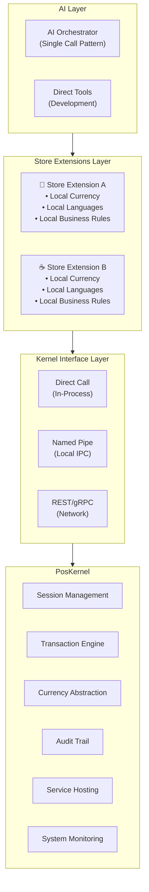
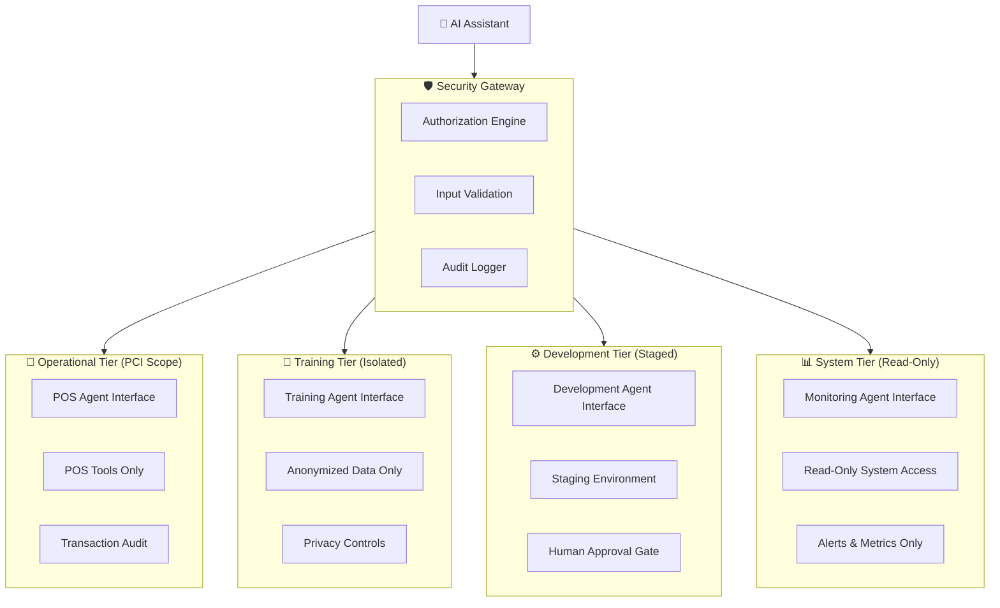
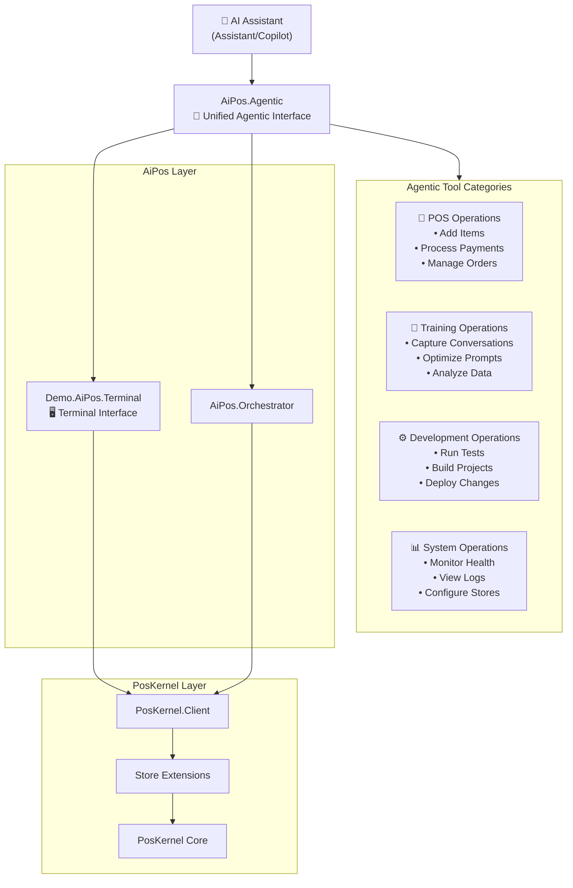
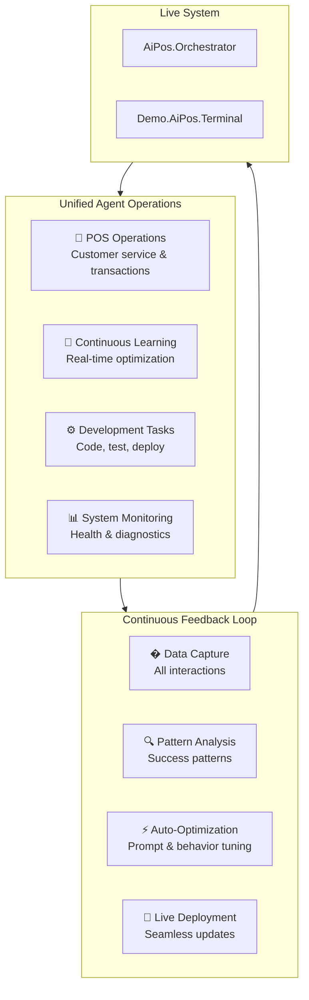

# AiPos Architecture Design

## Executive Summary

AiPos is a culture-neutral, AI-driven Point of Sale system that uses AI orchestration to handle customer interact   └── AiPos.Tests/                       # AI layer tests
       ├── AiPos.AI.Core.Tests/
       ├── AiPos.AI.Orchestrator.Tests/
       ├── AiPos.Agentic.Tests/
       └── AiPos.Demo.TUI.Tests/nd transaction processing. The system provides identical functionality through three distinct access patterns while maintaining cultural adaptability through store-specific extensions.

## Core Architecture Principles

### 1. **Three-Layer Unified Interface**



### 2. **Culture-Neutral Core with Store-Specific Extensions**

**ARCHITECTURAL PRINCIPLE**: The kernel knows nothing about currencies, languages, or business rules. All cultural aspects are provided by store extensions and validated at runtime.

**FAIL-FAST PRINCIPLE**: Missing configuration causes immediate failure with clear error messages, never silent defaults.

### **Fail-Fast Implementation Examples**

```csharp
// ARCHITECTURAL PRINCIPLE: Never provide fallback defaults
private string FormatCurrency(decimal amount)
{
    if (_currencyFormatter == null || _storeConfig == null)
    {
        throw new InvalidOperationException(
            "Currency formatting service not available. " +
            "Cannot format currency without proper service registration. " +
            "Register ICurrencyFormatter in DI container and ensure store configuration is loaded.");
    }

    return _currencyFormatter.FormatCurrency(amount, _storeConfig.Currency, _storeConfig.Culture);
}

// ARCHITECTURAL PRINCIPLE: Client must NOT decide business rules
private bool ValidateModificationPricing(string productId, IReadOnlyList<ModificationSelection> modifications)
{
    if (_modificationService == null)
    {
        throw new InvalidOperationException(
            "Modification service not registered. " +
            "Client cannot decide modification pricing rules. " +
            "Register IModificationService in DI container with store-specific business rules.");
    }

    return _modificationService.ValidateModifications(productId, modifications);
}
```

## Directory Structure

```
/
├── AiPos/                                 # Pure AI/agent architecture
│   ├── AiPos.Core/                        # AI interfaces and abstractions
│   │   ├── IToolExecutor.cs
│   │   ├── IAiOrchestrator.cs
│   │   └── Tools/
│   │       ├── AddItemTool.cs
│   │       ├── ApplyModificationTool.cs
│   │       └── ProcessPaymentTool.cs
│   │
│   ├── AiPos.Orchestrator/                # AI orchestrator implementation
│   │   ├── AiOrchestrator.cs
│   │   ├── DirectToolExecutor.cs
│   │   └── Configuration/
│   │       └── OrchestratorPrompts.cs
│   │
│   ├── AiPos.Agentic/                     # Unified agentic interface
│   │   ├── IAgenticServer.cs
│   │   ├── AgenticServerHost.cs
│   │   ├── Tools/
│   │   │   ├── PosOperations/
│   │   │   │   ├── AddItemTool.cs
│   │   │   │   ├── ApplyModificationTool.cs
│   │   │   │   └── ProcessPaymentTool.cs
│   │   │   ├── TrainingOperations/
│   │   │   │   ├── CaptureConversationTool.cs
│   │   │   │   ├── OptimizePromptTool.cs
│   │   │   │   └── AnalyzeDataTool.cs
│   │   │   ├── DevelopmentOperations/
│   │   │   │   ├── RunTestsTool.cs
│   │   │   │   ├── BuildProjectTool.cs
│   │   │   │   └── DeployChangesTool.cs
│   │   │   └── SystemOperations/
│   │   │       ├── MonitorSystemTool.cs
│   │   │       ├── ViewLogsTool.cs
│   │   │       └── ConfigureStoreTool.cs
│   │   └── Services/
│   │       ├── ConversationCaptureService.cs
│   │       ├── PromptOptimizationService.cs
│   │       ├── DataAnalysisService.cs
│   │       └── SystemIntegrationService.cs
│   │
│   └── AiPos.Tests/                       # AI layer tests
│       ├── AiPos.Core.Tests/
│       ├── AiPos.Orchestrator.Tests/
│       └── AiPos.Agentic.Tests/
│
├── PosKernel/                             # Pure kernel architecture
│   ├── PosKernel.Core/                    # Core transaction engine
│   │   ├── Interfaces/
│   │   │   ├── ITransactionService.cs
│   │   │   ├── ISessionManager.cs
│   │   │   └── IKernelEngine.cs
│   │   ├── Services/
│   │   │   ├── TransactionService.cs
│   │   │   ├── SessionManager.cs
│   │   │   └── KernelEngine.cs
│   │   └── Domain/
│   │       ├── Transaction.cs
│   │       ├── TransactionLine.cs
│   │       └── Money.cs
│   │
│   ├── PosKernel.Client/                  # Client interface layer
│   │   ├── IKernelClient.cs
│   │   ├── DirectKernelClient.cs          # In-process calls
│   │   ├── NamedPipeKernelClient.cs       # Local IPC
│   │   └── RestKernelClient.cs            # Network calls
│   │
│   ├── PosKernel.Service/                 # Service hosting
│   │   ├── Program.cs                     # Service host
│   │   ├── NamedPipeServer.cs             # IPC server
│   │   └── RestApiController.cs           # REST endpoints
│   │
│   ├── PosKernel.Extensions.Core/         # Extension interfaces
│   │   ├── IStoreExtension.cs
│   │   ├── IProductCatalog.cs
│   │   ├── ICurrencyFormatter.cs
│   │   └── IModificationService.cs
│   │
│   └── PosKernel.Tests/                   # Kernel layer tests
│       ├── PosKernel.Core.Tests/
│       ├── PosKernel.Client.Tests/
│       ├── PosKernel.Service.Tests/
│       └── PosKernel.Extensions.Core.Tests/
│
└── Demo/                                  # Implementation examples
    ├── AiPos/
    │   └── Terminal/                      # Demo.AiPos.Terminal
    │       ├── Program.cs                 # Terminal UI demo
    │       ├── DemoController.cs
    │       └── Views/
    │           ├── OrderView.cs
    │           └── ReceiptView.cs
    │
    └── PosKernel/
        └── Stores/
            └── FoodService/               # Food service industry vertical
                ├── ToastBoleh/            # Demo.PosKernel.FoodService.ToastBoleh
                │   ├── ToastBolehExtension.cs
                │   ├── SgdCurrencyFormatter.cs
                │   ├── KopitiamProductCatalog.cs
                │   └── Data/
                │       ├── kopitiam_products.sql
                │       └── kopitiam_modifications.sql
                │
                └── StarGrounds/           # Demo.PosKernel.FoodService.StarGrounds
                    ├── StarGroundsExtension.cs
                    ├── UsdCurrencyFormatter.cs
                    ├── CoffeeShopProductCatalog.cs
                    └── Data/
                        ├── coffeeshop_products.sql
                        └── coffeeshop_modifications.sql
```

## Core Interfaces

### Kernel Interface
```csharp
namespace PosKernel.Interfaces
{
    public interface IKernelEngine
    {
        Task<string> CreateSessionAsync(string terminalId, string operatorId, CancellationToken cancellationToken = default);
        Task<TransactionResult> StartTransactionAsync(string sessionId, string currency, CancellationToken cancellationToken = default);
        Task<TransactionResult> AddLineItemAsync(string sessionId, string transactionId, string productId, int quantity, decimal unitPrice, string? productName = null, string? productDescription = null, CancellationToken cancellationToken = default);
        Task<TransactionResult> ProcessPaymentAsync(string sessionId, string transactionId, decimal amount, string paymentType = "cash", CancellationToken cancellationToken = default);
        Task<TransactionResult> GetTransactionAsync(string sessionId, string transactionId, CancellationToken cancellationToken = default);
        Task CloseSessionAsync(string sessionId, CancellationToken cancellationToken = default);
    }
}
```

### Client Interface (Unified)
```csharp
namespace PosKernel.Client
{
    public interface IKernelClient : IDisposable
    {
        Task<string> CreateSessionAsync(string terminalId, string operatorId, CancellationToken cancellationToken = default);
        Task<TransactionResult> StartTransactionAsync(string sessionId, string currency, CancellationToken cancellationToken = default);
        Task<TransactionResult> AddLineItemAsync(string sessionId, string transactionId, string productId, int quantity, decimal unitPrice, string? productName = null, string? productDescription = null, CancellationToken cancellationToken = default);
        Task<TransactionResult> ProcessPaymentAsync(string sessionId, string transactionId, decimal amount, string paymentType = "cash", CancellationToken cancellationToken = default);
        Task<TransactionResult> GetTransactionAsync(string sessionId, string transactionId, CancellationToken cancellationToken = default);
        Task CloseSessionAsync(string sessionId, CancellationToken cancellationToken = default);
    }
}
```

### Store Extension Interface
```csharp
namespace PosKernel.Extensions.Core
{
    public interface IStoreExtension
    {
        Task<ProductValidationResult> ValidateProductAsync(string productId, CancellationToken cancellationToken = default);
        Task<List<ProductInfo>> SearchProductsAsync(string searchTerm, int maxResults = 50, CancellationToken cancellationToken = default);
        Task<List<ProductInfo>> GetPopularItemsAsync(CancellationToken cancellationToken = default);
        Task<ModificationValidationResult> ValidateModificationsAsync(string productId, IReadOnlyList<ModificationSelection> selections, CancellationToken cancellationToken = default);
        Task<decimal> CalculateModificationTotalAsync(IReadOnlyList<ModificationSelection> selections, CancellationToken cancellationToken = default);
    }

    public interface ICurrencyFormatter
    {
        string FormatCurrency(decimal amount, string currency, string culture);
        string GetCurrencySymbol(string currency);
        int GetDecimalPlaces(string currency);
    }
}
```

### AI Interface
```csharp
namespace AiPos.Core
{
    public interface IAiOrchestrator
    {
        Task<string> ProcessCustomerInteractionAsync(string customerInput, CancellationToken cancellationToken = default);
    }

    public interface IToolExecutor
    {
        Task<string> ExecuteToolAsync(string toolName, Dictionary<string, object> parameters, CancellationToken cancellationToken = default);
        IReadOnlyList<ToolDefinition> GetAvailableTools();
    }
}
```

## Store Configurations

### Example Store Configuration Structure
```json
{
  "storeId": "STORE_UNIQUE_ID",
  "storeName": "Store Display Name",
  "storeType": "IndustryVertical",
  "currency": "CURRENCY_CODE",
  "culture": "culture-code",
  "supportedLanguages": ["lang1", "lang2", "lang3"],
  "databasePath": "Data/store_catalog.sqlite",
  "extensions": {
    "productCatalog": "Demo.PosKernel.FoodService.StoreType.ProductCatalog",
    "currencyFormatter": "Demo.PosKernel.FoodService.StoreType.CurrencyFormatter",
    "modificationService": "Demo.PosKernel.FoodService.StoreType.ModificationService"
  },
  "businessRules": {
    "modificationPricing": "free|charged",
    "tipCulture": true|false,
    "taxInclusive": true|false,
    "taxRate": 0.00
  }
}
```

**Note**: Specific store implementations (such as Singapore Kopitiam and American Coffee Shop examples) are available in the Demo/PosKernel/Stores/FoodService/ directory as reference implementations showing how to configure the architecture for different cultural and business contexts.

## AI Architecture

### Orchestrator Pattern
The system uses a single-call AI orchestrator pattern for processing customer interactions:

```
Customer Input → AI Orchestrator → Tool Selection & Execution → Response
```

**Key Benefits**:
- **Predictable Performance**: Single AI call with deterministic timing
- **Simplified Debugging**: Clear execution path and error handling
- **Resource Efficiency**: Lower computational overhead
- **Proven Reliability**: Established pattern with known behavior characteristics

## Security and Risk Analysis

### 🚨 **Critical Security Concerns**

#### **1. Prompt Injection Attack Surface**
**Risk**: Unified agentic interface creates massive attack surface where prompt injection could:
- Manipulate financial transactions and steal payment data
- Poison training data to compromise AI behavior
- Deploy malicious code changes to production systems
- Access sensitive system logs and customer data
- Reconfigure store settings and business rules

**Mitigation Required**: Tool isolation, input validation, privilege boundaries

#### **2. Excessive Agent Privileges**
**Risk**: Violates principle of least privilege - agents have unnecessary access across all operation types
- Customer service agents shouldn't deploy code
- Training operations shouldn't access payment data
- Development tools shouldn't modify live transactions

**Mitigation Required**: Role-based access control, capability isolation

#### **3. Data Privacy Violations**
**Risk**: Automatic conversation capture without explicit consent violates GDPR, CCPA
- Customer data used for training without consent
- No data retention or deletion policies
- Cross-border data transfer issues
- No anonymization or pseudonymization

**Mitigation Required**: Privacy-by-design, consent mechanisms, data governance

#### **4. Real-time Optimization Risks**
**Risk**: Automatic prompt deployment without human oversight
- Optimized prompts could leak sensitive data
- AI could learn harmful behaviors from edge cases
- No rollback mechanism for bad optimizations
- Compliance violations from unreviewed changes

**Mitigation Required**: Human-in-the-loop approval, staged deployment, rollback capabilities

### 🏛️ **Compliance and Governance Issues**

#### **Regulatory Compliance**
- **PCI DSS**: Mixed operational/development access violates segregation requirements
- **SOX**: Self-modifying financial systems may not pass audit
- **Industry Standards**: Many sectors require separation of duties

#### **Audit and Accountability**
- **Action Traceability**: Who is responsible for AI agent decisions?
- **Change Control**: No formal process for AI-driven changes
- **Evidence Preservation**: How to maintain audit trails for self-modifying systems?

### ⚙️ **Operational Risks**

#### **System Reliability**
- **Single Point of Failure**: Unified interface becomes critical bottleneck
- **Complexity**: Harder to debug and maintain than separated systems
- **Cascade Failures**: Problems in one area can compromise everything

#### **Business Continuity**
- **Rollback Complexity**: How to recover from bad AI optimizations?
- **Vendor Lock-in**: Tight coupling makes component replacement difficult
- **Insurance Coverage**: Cyber policies may not cover self-modifying AI losses

## Improved Security Architecture

### 🔒 **Security-First Agentic Design**

**Principle**: Maintain agentic benefits while implementing proper security boundaries and controls.

#### **Tiered Agentic Interface with Security Boundaries**



#### **Role-Based Agent Capabilities**

```csharp
namespace AiPos.Security
{
    public enum AgentRole
    {
        CustomerService,    // POS operations only
        DataScientist,     // Training operations only (anonymized data)
        Developer,         // Development operations (staging only)
        SystemAdmin,       // System monitoring only (read-only)
        SupervisorAgent    // Cross-tier with approval workflows
    }

    public interface ISecureAgentCapabilities
    {
        bool CanExecuteTool(AgentRole role, string toolCategory, string toolName);
        Task<bool> RequiresHumanApprovalAsync(string operation);
        Task LogAgentActionAsync(AgentRole role, string action, object parameters);
    }
}
```

### 🔐 **Security Controls Implementation**

#### **1. Input Validation and Sanitization**
```csharp
public interface IPromptSecurityValidator
{
    Task<ValidationResult> ValidateInputAsync(string input, AgentRole role);
    Task<bool> DetectInjectionAttemptAsync(string input);
    Task<string> SanitizeInputAsync(string input);
}
```

#### **2. Data Privacy and Consent**
```csharp
public interface IPrivacyController
{
    Task<bool> HasConsentForDataUseAsync(string customerId, DataUseType useType);
    Task<string> AnonymizeConversationAsync(string conversation);
    Task EnforceDataRetentionAsync();
    Task HandleDataDeletionRequestAsync(string customerId);
}
```

#### **3. Deployment Safety Controls**
```csharp
public interface IDeploymentSafetyController
{
    Task<bool> ValidatePromptSafetyAsync(string prompt);
    Task<DeploymentApproval> RequestHumanApprovalAsync(string change);
    Task<bool> CanRollbackAsync(string deploymentId);
    Task RollbackDeploymentAsync(string deploymentId);
}
```

### 📊 **Monitoring and Compliance**

#### **Comprehensive Audit Trail**
- **Agent Identity**: Every action traced to specific agent instance
- **Business Justification**: Why each action was taken
- **Data Lineage**: Track all data transformations and usage
- **Change History**: Complete history of AI-driven changes
- **Approval Workflows**: Human oversight for sensitive operations

#### **Real-time Security Monitoring**
- **Anomaly Detection**: Unusual agent behavior patterns
- **Injection Attempt Detection**: Real-time prompt analysis
- **Data Access Monitoring**: Unusual data access patterns
- **Performance Impact**: Security control overhead measurement

## Development Strategy Considerations

**The Unified Agentic Approach**:
- **Multi-Purpose Interface**: Single agentic server handles POS operations, training, and development
- **Seamless Integration**: AI agents can move between operational and training tasks
- **Continuous Feedback Loop**: Operational data automatically feeds into training pipeline
- **Development Integration**: Code changes, testing, and deployment through same interface
- **Real-time Adaptation**: System can self-optimize during operation

**Unified Agentic Architecture**:


**Unified Agentic Benefits**:
1. **Single Interface**: All agent operations go through one unified protocol
2. **Continuous Learning**: Operational data seamlessly feeds training pipeline
3. **Self-Improving System**: AI can optimize itself during operation
4. **Development Integration**: Agents can modify, test, and deploy code changes
5. **Holistic Monitoring**: Complete system visibility through unified interface

### Unified Agentic Interface with Continuous Learning

**Agentic System Design**:


### Test Strategy

**Comprehensive Test Coverage**:
- **Unit Tests**: Each component tested in isolation
- **Integration Tests**: Layer-to-layer interaction validation
- **Functionality Tests**: Component behavior validation
- **Culture Tests**: Multi-language/currency validation
- **AI Orchestrator Tests**: AI pattern effectiveness validation
- **Training Tests**: Prompt optimization effectiveness

**Test Structure**:
```
Tests use Microsoft.NET.Test.Sdk with Microsoft testing framework:
- PosKernel.Tests/: Kernel layer testing
- AiPos.Tests/: AI layer testing
- Integration.Tests/: Cross-layer testing
- Functionality.Tests/: Component behavior validation
```

## Development Phases

### Phase 1: Foundation and Kernel Layer
1. **Project Structure Setup**
   - Create PosKernel/ and AiPos/ directory structure
   - Set up test projects with Microsoft.NET.Test.Sdk and Microsoft testing framework
   - Configure solution and project dependencies

2. **Kernel Extraction and Service Layer**
   - Extract core kernel functionality from existing PosKernel
   - Implement three client access patterns (Direct, NamedPipe, REST)
   - Create basic service host with health checks and monitoring
   - **Comprehensive Testing**: Unit and integration tests for all kernel components

### Phase 2: Store Extensions and Culture Framework
1. **Store Extension Framework**
    - Create culture-neutral interfaces and validation in PosKernel.Extensions.Core
    - **Testing**: Multi-culture validation test suites

2. **Unified FoodService Store Implementations**
    - Single FoodService assembly supports multiple store profiles (e.g., Toast Boleh, Star Grounds) via `.xfer` configuration.
    - Profiles provide: currency, culture, product & modifier catalogs, payment types, prompt pack references.
    - Currency formatting and localization services are per-profile; fail-fast if missing.
    - **Testing**: Culture-specific business rule validation across both profiles.

### Phase 3: AI Layer Implementation
1. **AI Core Infrastructure**
   - Implement AI Orchestrator with single-call pattern in AiPos.Orchestrator
   - Create unified tool execution framework in AiPos.Core
   - **Testing**: AI orchestrator effectiveness tests

2. **Training and Optimization System**
   - Implement conversation capture and analysis in AiPos.Agentic
   - Create prompt optimization pipeline
   - Build data tracking and analytics
   - **Testing**: Training effectiveness validation

### Phase 4: Unified Agentic Interface (MCP integration previously established)
1. **Agentic Server Implementation**
   - Create unified agentic server for all agent operations
   - Implement tool categories: POS, Training, Development, System
   - Integrate continuous learning and feedback loops
   - **Testing**: Agentic protocol compliance and functionality

2. **Demo Applications**
    - Demo.AiPos.Terminal TUI (store selection + AI cashier)
    - Demo.PosKernel.Terminal CLI (kernel-only deterministic driver)
    - Build comprehensive culture and functionality validation suite
    - **Testing**: End-to-end agentic scenario (AI + CLI + MCP tools)

## Deployment and Installation

### Deployment Architecture

The system deploys into two separate directories to maintain architectural boundaries:

- **`~/.poskernel/`**: Kernel services, store configurations, transaction logs, audit trails
- **`~/.aipos/`**: AI models, prompts, training data, agentic configurations, conversation history

### Installation Scripts

**PowerShell Installation Scripts** (POC Phase):
```powershell
install-poskernel.ps1    # Install/update PosKernel services and ~/.poskernel/
install-aipos.ps1        # Install/update AiPos services and ~/.aipos/
install-demo.ps1         # Install/update demo stores and configurations
```

**Script Features**:
- **Update-Safe**: Detect existing installations and update intelligently
- **Incremental**: Support frequent updates during development cycles
- **Build Integration Ready**: Designed for potential integration with build pipeline
- **Configuration Preservation**: Maintain user configurations during updates
- **Rollback Support**: Enable quick rollback to previous versions

**Example Installation Flow**:
```powershell
# Fresh installation
.\install-poskernel.ps1 -Clean
.\install-aipos.ps1 -Clean
.\install-demo.ps1 -Stores ToastBoleh,StarGrounds

# Update existing installation
.\install-poskernel.ps1 -Update
.\install-aipos.ps1 -Update
.\install-demo.ps1 -Update
```

### Deployment Benefits

1. **Independent Updates**: Update kernel without affecting AI layer and vice versa
2. **Security Boundaries**: Separate data types with different access patterns
3. **Backup Strategies**: Selective backup of transaction vs. training data
4. **Compliance Support**: Easier audit trails with separated concerns
5. **Development Velocity**: Rapid iteration during POC phase

## Store Data & Schema Migration Strategy

**Status**: Planned (integration beginning – legacy databases detected under user profile).
**Legacy Paths**:
```
%USERPROFILE%\.poskernel\extensions\retail\SingaporeKopitiam\catalog\retail_catalog.db
%USERPROFILE%\.poskernel\extensions\retail\CoffeeShop\catalog\retail_catalog.db
```

### Architectural Principles Applied
- **Fail-Fast**: Application MUST refuse to start a store extension if required schema version is not satisfied or checksum mismatch is detected.
- **No Silent Data Loss**: Every migration creates a timestamped backup copy before alteration.
- **Deterministic Versioning**: Linear, integer version sequence (V1, V2, …) per store; no implicit diffs.
- **Immutable History**: Applied script checksums stored; modifications to historical scripts produce a checksum mismatch and fail.

### Versioning Model
Migration scripts are embedded resources per store extension project:
```
Demo/PosKernel/Stores/FoodService/ToastBoleh/Data/Migrations/V1__InitialSchema.sql
Demo/PosKernel/Stores/FoodService/ToastBoleh/Data/Migrations/V2__Add_Modifier_Groups.sql
... etc.
```
Each script applied exactly once in ascending numeric order. A shared table records progress:
```sql
CREATE TABLE IF NOT EXISTS StoreSchemaVersion (
    Version INTEGER NOT NULL PRIMARY KEY,
    AppliedUtc TEXT NOT NULL,
    Checksum TEXT NOT NULL,
    ScriptName TEXT NOT NULL
);
```

### Legacy Database Adoption (V0 Bootstrap)
1. Detect absence of `StoreSchemaVersion` table ⇒ treat DB as legacy (implicit V0).
2. Create backup: `retail_catalog.db.bak-YYYYMMDD-HHMMSS` (fail if copy fails).
3. Introspect current schema:
   - If matches expected new V1 schema (structure-only comparison), insert synthetic row representing V1 with computed checksum of canonical V1 script (bootstrap adoption – no destructive changes).
   - Else run transformation script `V1__Baseline_Transform.sql` that reshapes tables to the canonical schema, then record version.
4. Proceed with subsequent migrations (V2+).

### Migration Execution Flow (Startup)
1. Open connection (exclusive lock not required beyond transactional script execution; each script runs within a transaction).
2. Ensure version table exists (create if legacy).
3. Enumerate embedded scripts (sorted by version number).
4. For each script where `Version > MAX(Version in StoreSchemaVersion)`: execute inside a transaction, compute SHA256 checksum of normalized script contents, record row.
5. After completion, recompute checksums for applied versions; mismatch ⇒ throw with remediation guidance.

### Safety & Failure Modes
| Condition | Action |
|-----------|--------|
| Missing script for a gap (e.g., have V1 & V3 only) | Fail-fast (gaps disallowed) |
| Checksum mismatch | Fail-fast with message: script tampered or out-of-sync; instruct to restore from backup or reapply canonical scripts |
| Newer DB than extension (DB at 5, extension `RequiredSchemaVersion` 4) | Fail-fast: extension outdated, upgrade code required |
| Read-only file system & pending migrations | Fail-fast with explicit permission guidance |
| Partial script failure | Rollback transaction, abort startup |

### Backup & Recovery
Every migration run creates a compressed archive (optional future) or at minimum a copy of the original DB before the first pending script is applied. Restoration procedure documented in failure message.

### Extension Interface Additions (Planned)
```csharp
public interface IStoreMigrationInfo
{
    int RequiredSchemaVersion { get; }
    IReadOnlyList<StoreMigrationScript> GetScripts(); // (Version, Name, Stream, ChecksumPrecomputed?)
}

public sealed record StoreMigrationScript(int Version, string Name, Stream ContentStream);
```
The extension loader composes a `MigrationRunner` which performs the algorithm above before exposing the catalog.

### PowerShell Migration Utility (Planned)
`scripts/migrate-stores.ps1` options:
```
.\​migrate-stores.ps1 -Store SingaporeKopitiam -DryRun
.\​migrate-stores.ps1 -All -Apply
```
Outputs table: Store, CurrentVersion, TargetVersion, Status.

### Testing Strategy
- Legacy adoption test: start with pre-populated DB lacking version table; expect bootstrap insert + no data loss.
- Idempotency: running migrations twice produces no additional rows.
- Tamper detection: alter an applied script file → mismatch exception.
- Outdated extension simulation: manually increment DB version beyond extension; startup must fail.
- Transformation path: feed DB with older/variance schema and verify `V1__Baseline_Transform.sql` normalizes it.

### Status Matrix Integration
Add row (below) to Appendix A to track implementation.

### Rollout Sequence (Planned Alignment with Phases)
- Incorporated at start of P1 (before modification pricing) so pricing logic relies on normalized schema.
- Security (P2) will later rely on consistent schema to enforce RBAC around migration operations.

### Failure Message Pattern
```
Store database not at required schema version.
Store: SingaporeKopitiam
Current: 1  Required: 3
Pending: V2__Add_Modifier_Groups.sql, V3__Add_Tax_Rules.sql
Remediation: Run migrate-stores.ps1 -Store SingaporeKopitiam -Apply or grant write access for automatic migration.
Backup created: retail_catalog.db.bak-20251010-081500
```

---

## Key Architectural Decisions Made

### ✅ **Security-First Agentic Design**:
- **Rationale**: Tiered security boundaries prevent privilege escalation and limit blast radius
- **Benefit**: Maintains agentic benefits while meeting enterprise security requirements
- **Implementation**: Role-based agent capabilities with mandatory security controls

### ✅ **Privacy-by-Design Data Handling**:
- **Rationale**: Proactive privacy compliance prevents regulatory violations and builds customer trust
- **Benefit**: Enables training and optimization while respecting customer privacy rights
- **Implementation**: Consent-based data collection with anonymization and retention controls

### ✅ **Human-in-the-Loop Safety Controls**:
- **Rationale**: AI-driven changes to production systems require human oversight for safety and compliance
- **Benefit**: Enables rapid optimization while maintaining business risk controls
- **Implementation**: Approval workflows for sensitive operations with rollback capabilities

### ✅ **Comprehensive Test Coverage**:
- **Rationale**: Complex multi-layer architecture requires extensive validation
- **Benefit**: Provides confidence in culture-neutral operation and functionality
- **Implementation**: Microsoft test tools with dedicated test projects for each layer

### ✅ **Directory Separation**:
- **Rationale**: Clear separation between existing kernel (PosKernel/) and AI innovation (AiPos/)
- **Benefit**: Reduces clutter, makes architectural boundaries clear
- **Implementation**: Two top-level directories with complete separation

## Next Steps - Design Completion

We've captured the key architectural decisions but need to detail several critical areas before implementation:

### 🎯 **Immediate Design Tasks**:

1. **Unified Agentic Tool Catalog**
   - Define complete tool catalog across all operation categories
   - Specify tool parameters and return formats for POS, training, development, and system operations
   - Design state management and context sharing between tool categories

2. **Continuous Learning Pipeline Specification**
   - Detail real-time conversation capture and analysis mechanisms
   - Define automatic prompt optimization algorithms and deployment
   - Specify feedback loop integration and live system updates

3. **Test Strategy Refinement**
   - Define agentic scenario test cases across all operation types
   - Specify functionality validation criteria for unified interface
   - Detail continuous learning effectiveness measurement

4. **Store Extension API Finalization**
   - Complete interface definitions for culture-neutral operations
   - Define store configuration schema with agentic integration
   - Specify extension loading and validation mechanisms

### 🔄 **Architecture Questions to Resolve**:

1. **Security Boundary Enforcement**: How do we prevent privilege escalation between agent tiers?
2. **Privacy Compliance**: How do we ensure GDPR/CCPA compliance with automatic data collection?
3. **Deployment Safety**: What approval workflows are required for AI-driven changes?
4. **Incident Response**: How do we rapidly respond to compromised agent behavior?
5. **Cross-Border Compliance**: How do we handle international data protection regulations?
6. **Insurance and Liability**: How do we manage business risk from AI agent decisions?

### 📋 **Pre-Implementation Checklist**:
- [ ] Complete security threat model and risk assessment
- [ ] Design role-based access control system
- [ ] Implement privacy-by-design data handling
- [ ] Create deployment safety and rollback mechanisms
- [ ] Define incident response procedures for agent compromise
- [ ] Establish compliance audit trails and evidence collection
- [ ] Design human oversight and approval workflows
- [ ] Create security monitoring and alerting systems

**Current Status**: Security analysis complete, architecture revised for enterprise deployment. Critical security controls identified and designed. Ready for security-first implementation approach.

## Appendix A: Staged Remediation & Implementation Tracker

This appendix captures the staged remediation plan. It MUST be updated as phases progress. All phases preserve the architectural principles: fail-fast, culture neutrality, strict layering, and no silent defaults.

### Phase Overview

| Phase | Name | Objective | Exit Criteria |
|-------|------|-----------|---------------|
| P0 | Structural Guardrails | Eliminate hidden assumptions & placeholder shortcuts | Config provider, currency abstraction usage, pricing via catalog, parameter validator, initial AI tests |
| P1 | Deterministic Store Integration | Real store config + modification pricing + prompt assets | End-to-end test with catalog & modifications; currency/time culture neutrality enforced |
| P2 | Security & Governance | Role/capability model, audit, privacy, prompt safety | Unauthorized tool blocked; audit entries created |
| P3 | Tool Ecosystem Maturation | Tool classes, schema validation, discovery | Reflection discovery passes; invalid param tests fail-fast |
| P4 | Transports & Service Mode | NamedPipe + REST parity with direct client | Same test suite passes over all transports |
| P5 | Operational Hardening | Health, metrics, install scripts, failure injection | Health tool + metrics + installer idempotency proven |
| P6 | Extended AI & Training Loop | Training tools, optimization feedback | Training exemplar influences orchestrator config without breaking tests |

### Status Matrix

| Capability | Implemented | Notes |
|------------|------------|-------|
| Single-call orchestrator | ✅ | Heuristic keyword routing currently |
| Catalog-based pricing | ✅ | Orchestrator no longer injects price; demo uses catalog |
| Store configuration provider | ✅ | InMemory provider integrated (will evolve) |
| Currency formatting via service | ✅ | Demo render path enforces formatter usage |
| Parameter validation | ✅ | DirectToolExecutor validates & normalizes |
| Tool categorization folders | ✅ | Scaffolded (all category directories with README) |
| Security roles & capabilities | ❌ | Planned P2 |
| Audit sink | ❌ | Planned P2 minimal, expanded P5 |
| Privacy & sanitization | ❌ | Planned P2 |
| Prompt asset configuration | ❌ | Planned P1 |
| Modification pricing pipeline | ❌ | Planned P1 |
| Store DB migrations | ⏳ | Migration infrastructure (interfaces + runner + basic tests) added; integration & real scripts pending |
| NamedPipe transport | ❌ | Planned P4 |
| REST transport | ❌ | Planned P4 |
| Metrics / Health | ❌ | Planned P5 |
| Training toolset | ❌ | Planned P6 |
| Optimization loop | ❌ | Planned P6 |
| Roslyn analyzer (hardcode scan) | ❌ | Future (post P3) |

### P0 Detailed Tasks (Active Phase)

1. Domain Type Canonicalization
    - Confirm Money & identifier types exist only in one canonical location (PosKernel.Core Domain).
    - Remove duplicates from Abstractions if present; update references.
    - Add architectural comment at type definition: single source of truth.
2. Store Configuration Provider
    - Introduce `IStoreConfigurationProvider` exposing Currency, Culture, SupportedPaymentTypes.
    - Fail-fast if requested before initialization.
    - Replace hardcoded "USD" in orchestrator/demo path with provider-driven value.
3. Currency Formatting Enforcement
    - Ensure all display formatting calls a provided `ICurrencyFormatter` (no `.ToString("F2")`).
    - Add fail-fast guard if formatter missing.
4. Catalog-Based Pricing
    - Replace placeholder unit price (0m or literals in AI tool handlers) with lookup via `IProductCatalog`.
    - Fail-fast if product not found or price unresolved.
5. Parameter Validation Layer
    - Add `ToolParameterDescriptor` (Name, Type, Required, Min/Max optional) + validator.
    - Orchestrator validates before execution; descriptive exception on first failure.
6. Tool Categorization Scaffold
    - Create directory structure for tool categories (POS only populated in P0; others stub with README or NotImplemented exceptions).
7. Initial AI Test Project
    - Add test project (AiPos.Orchestrator.Tests or unified AiPos.Tests if simpler) with tests:
      * Missing config provider => fail-fast
      * Add item success path (catalog price applied)
      * Unknown product => descriptive failure
8. Architecture Doc Sync
    - Update Status Matrix as each P0 item completes.
9. Build Hygiene
    - Ensure zero warnings after each code addition (TreatWarningsAsErrors enforced).

### P0 Acceptance Criteria

| Criterion | Verification |
|-----------|--------------|
| No hardcoded currency in orchestrator/demo path | Grep search for "\"USD\"" returns only test data & docs |
| Pricing always via catalog | Unit test asserts non-zero price equals catalog price |
| Missing config fails fast | Test expects InvalidOperationException with remediation message |
| Parameter validator active | Invalid param test throws with tool + param name |
| Tool categories scaffolded | Directory structure exists under AiPos.Agentic/Tools |
| Tests green & build clean | CI / local build shows 0 warnings |

### Change Logging Rule
Every phase advancement or task completion MUST: (a) update Status Matrix, (b) add brief note in DEV_LOG (if present), (c) ensure tests reflect new invariant.

---
Last Appendix Update: P0 core tasks implemented (config provider, pricing via catalog, currency formatting, parameter validation, tool folders, initial tests). Remaining: optional formatter test & DEV_LOG note.
Maintainer: Architecture Working Set

```
## Prompt-Driven Lexicon Strategy (Supersedes Static Token Tables)

ARCHITECTURAL DECISION: Do not embed static curated synonym/token tables for vernacular ordering (e.g., "kopi c kosong" or American espresso customization). Instead, the orchestrator supplies rich, profile-derived prompt context: products, modifiers (with applicability + conflicts), payment types, and illustrative mappings. The model's innate knowledge performs interpretation; every proposed product/modifier is validated by the store extension (fail-fast on unknowns).

Rationale:
- Eliminates drift between catalog data and hardcoded synonym lists.
- Reduces maintenance when adding new products/modifiers (prompt context auto-updates from catalog).
- Avoids regional bias baked into code; leverages model generalization while maintaining validation safety net.
- Keeps architecture culture-neutral: only data + rules flow upward, not procedural parsing logic in the AI layer.

Validation Workflow:
1. User utterance → single `ProcessUtterance` AI call with prompt context (enumerated products, modifiers, conflicts, payment constraints).
2. Tool output (structured JSON/actions) returned by orchestrator.
3. Store extension validates each product & modifier and enforces conflicts/payment rules.
4. Any invalid element invalidates the entire action set; guidance returned (no partial silent acceptance).

Telemetry (future): counters for accepted vs rejected action sets; refine prompt examples rather than adding code-level lexicon tables.

## Kernel-Only CLI (Phase 0.5 Diagnostic Driver)

Purpose: Deterministic, non-AI path to exercise store profiles, pricing, modifier and payment rules.

Commands (fail-fast, no implicit defaults):
- `help` – list commands & syntax.
- `stores` – list store profiles.
- `use <storeId>` – activate profile (required before transactional commands).
- `items [filter]` – list sellable items (optional substring filter).
- `mods <productId>` – list modifiers applicable to a product (or all if supported when productId omitted in future).
- `payments` – list payment types with capability flags (allowsChange, requiresExact, nonRefundable, etc.).
- `new` – open new transaction (error if already open or profile not selected).
- `add <productId> [qty]` – add line (qty default=1; must be >0).
- `apply <line#> add <modId>[,<modId>...]` – apply modifiers.
- `apply <line#> remove <modId>[,<modId>...]` – remove modifiers.
- `void <line#>` – void individual line.
- `voidtx` – void entire transaction.
- `show` – display receipt & totals (currency via store `ICurrencyFormatter`).
- `pay <amount> <paymentType>` – tender payment. If payment type disallows change and amount > due → fail-fast.
- `close` – close session (if supported).

Design Constraints:
- CLI must not perform pricing or currency logic beyond delegating to kernel & store services.
- Unknown commands produce descriptive error referencing `help`.
- Payment semantics (e.g., disallow change) enforced by store extension validation layer.

MCP Parity: MCP tool surface mirrors these deterministic operations plus `processUtterance` for the AI path; avoids divergence.

// ARCHITECTURAL PRINCIPLE: CLI is diagnostic; all business rules live in store extensions + kernel (fail-fast on missing services).
```
