# AiPos Architecture Design

## Executive Summary

AiPos is a culture-neutral, AI-driven Point of Sale system that uses AI orchestration to handle customer interact   └── AiPos.Tests/                       # AI layer tests
       ├── AiPos.AI.Core.Tests/
       ├── AiPos.AI.Orchestrator.Tests/
       ├── AiPos.Agentic.Tests/
       └── AiPos.Demo.TUI.Tests/nd transaction processing. The system provides identical functionality through three distinct access patterns while maintaining cultural adaptability through store-specific extensions.

## Core Architecture Principles

### 1. **Three-Layer Unified Interface**

```mermaid
graph TB
    subgraph AI["AI Layer"]
        direction LR
        Orchestrator["AI Orchestrator<br/>(Single Call Pattern)"]
        DirectTools["Direct Tools<br/>(Development)"]
    end

    subgraph Extensions["Store Extensions Layer"]
        direction LR
        StoreA["🏪 Store Extension A<br/>• Local Currency<br/>• Local Languages<br/>• Local Business Rules"]
        StoreB["☕ Store Extension B<br/>• Local Currency<br/>• Local Languages<br/>• Local Business Rules"]
    end

    subgraph Interface["Kernel Interface Layer"]
        direction LR
        DirectCall["Direct Call<br/>(In-Process)"]
        NamedPipe["Named Pipe<br/>(Local IPC)"]
        RestGrpc["REST/gRPC<br/>(Network)"]
    end

    subgraph Kernel["PosKernel"]
        direction LR
        SessionMgmt["Session Management"]
        TransactionEngine["Transaction Engine"]
        CurrencyAbstraction["Currency Abstraction"]
        AuditTrail["Audit Trail"]
        ServiceHosting["Service Hosting"]
        SystemMonitoring["System Monitoring"]
    end

    AI --> Extensions
    Extensions --> Interface
    Interface --> Kernel
```



### 2. **Culture-Neutral Core with Store-Specific Extensions**

**ARCHITECTURAL PRINCIPLE**: The kernel knows nothing about currencies, languages, or business rules. All cultural aspects are provided by store extensions and validated at runtime.

**FAIL-FAST PRINCIPLE**: Missing configuration causes immediate failure with clear error messages, never silent defaults.

### **Fail-Fast Implementation Examples**

```csharp
// ARCHITECTURAL PRINCIPLE: Never provide fallback defaults
private string FormatCurrency(decimal amount)
{
    if (_currencyFormatter == null || _storeConfig == null)
    {
        throw new InvalidOperationException(
            "DESIGN DEFICIENCY: Currency formatting service not available. " +
            "Cannot format currency without proper service registration. " +
            "Register ICurrencyFormatter in DI container and ensure store configuration is loaded.");
    }

    return _currencyFormatter.FormatCurrency(amount, _storeConfig.Currency, _storeConfig.Culture);
}

// ARCHITECTURAL PRINCIPLE: Client must NOT decide business rules
private bool ValidateModificationPricing(string productId, IReadOnlyList<ModificationSelection> modifications)
{
    if (_modificationService == null)
    {
        throw new InvalidOperationException(
            "DESIGN DEFICIENCY: Modification service not registered. " +
            "Client cannot decide modification pricing rules. " +
            "Register IModificationService in DI container with store-specific business rules.");
    }

    return _modificationService.ValidateModifications(productId, modifications);
}
```

## Directory Structure

```
/
├── AiPos/                                 # Pure AI/agent architecture
│   ├── AiPos.Core/                        # AI interfaces and abstractions
│   │   ├── IToolExecutor.cs
│   │   ├── IAiOrchestrator.cs
│   │   └── Tools/
│   │       ├── AddItemTool.cs
│   │       ├── ApplyModificationTool.cs
│   │       └── ProcessPaymentTool.cs
│   │
│   ├── AiPos.Orchestrator/                # AI orchestrator implementation
│   │   ├── AiOrchestrator.cs
│   │   ├── DirectToolExecutor.cs
│   │   └── Configuration/
│   │       └── OrchestratorPrompts.cs
│   │
│   ├── AiPos.Agentic/                     # Unified agentic interface
│   │   ├── IAgenticServer.cs
│   │   ├── AgenticServerHost.cs
│   │   ├── Tools/
│   │   │   ├── PosOperations/
│   │   │   │   ├── AddItemTool.cs
│   │   │   │   ├── ApplyModificationTool.cs
│   │   │   │   └── ProcessPaymentTool.cs
│   │   │   ├── TrainingOperations/
│   │   │   │   ├── CaptureConversationTool.cs
│   │   │   │   ├── OptimizePromptTool.cs
│   │   │   │   └── AnalyzeDataTool.cs
│   │   │   ├── DevelopmentOperations/
│   │   │   │   ├── RunTestsTool.cs
│   │   │   │   ├── BuildProjectTool.cs
│   │   │   │   └── DeployChangesTool.cs
│   │   │   └── SystemOperations/
│   │   │       ├── MonitorSystemTool.cs
│   │   │       ├── ViewLogsTool.cs
│   │   │       └── ConfigureStoreTool.cs
│   │   └── Services/
│   │       ├── ConversationCaptureService.cs
│   │       ├── PromptOptimizationService.cs
│   │       ├── DataAnalysisService.cs
│   │       └── SystemIntegrationService.cs
│   │
│   └── AiPos.Tests/                       # AI layer tests
│       ├── AiPos.Core.Tests/
│       ├── AiPos.Orchestrator.Tests/
│       └── AiPos.Agentic.Tests/
│
├── PosKernel/                             # Pure kernel architecture
│   ├── PosKernel.Core/                    # Core transaction engine
│   │   ├── Interfaces/
│   │   │   ├── ITransactionService.cs
│   │   │   ├── ISessionManager.cs
│   │   │   └── IKernelEngine.cs
│   │   ├── Services/
│   │   │   ├── TransactionService.cs
│   │   │   ├── SessionManager.cs
│   │   │   └── KernelEngine.cs
│   │   └── Domain/
│   │       ├── Transaction.cs
│   │       ├── TransactionLine.cs
│   │       └── Money.cs
│   │
│   ├── PosKernel.Client/                  # Client interface layer
│   │   ├── IKernelClient.cs
│   │   ├── DirectKernelClient.cs          # In-process calls
│   │   ├── NamedPipeKernelClient.cs       # Local IPC
│   │   └── RestKernelClient.cs            # Network calls
│   │
│   ├── PosKernel.Service/                 # Service hosting
│   │   ├── Program.cs                     # Service host
│   │   ├── NamedPipeServer.cs             # IPC server
│   │   └── RestApiController.cs           # REST endpoints
│   │
│   ├── PosKernel.Extensions.Core/         # Extension interfaces
│   │   ├── IStoreExtension.cs
│   │   ├── IProductCatalog.cs
│   │   ├── ICurrencyFormatter.cs
│   │   └── IModificationService.cs
│   │
│   └── PosKernel.Tests/                   # Kernel layer tests
│       ├── PosKernel.Core.Tests/
│       ├── PosKernel.Client.Tests/
│       ├── PosKernel.Service.Tests/
│       └── PosKernel.Extensions.Core.Tests/
│
└── Demo/                                  # Implementation examples
    ├── AiPos/
    │   └── Terminal/                      # Demo.AiPos.Terminal
    │       ├── Program.cs                 # Terminal UI demo
    │       ├── DemoController.cs
    │       └── Views/
    │           ├── OrderView.cs
    │           └── ReceiptView.cs
    │
    └── PosKernel/
        └── Stores/
            └── FoodService/               # Food service industry vertical
                ├── ToastBoleh/            # Demo.PosKernel.FoodService.ToastBoleh
                │   ├── ToastBolehExtension.cs
                │   ├── SgdCurrencyFormatter.cs
                │   ├── KopitiamProductCatalog.cs
                │   └── Data/
                │       ├── kopitiam_products.sql
                │       └── kopitiam_modifications.sql
                │
                └── StarGrounds/           # Demo.PosKernel.FoodService.StarGrounds
                    ├── StarGroundsExtension.cs
                    ├── UsdCurrencyFormatter.cs
                    ├── CoffeeShopProductCatalog.cs
                    └── Data/
                        ├── coffeeshop_products.sql
                        └── coffeeshop_modifications.sql
```

## Core Interfaces

### Kernel Interface
```csharp
namespace PosKernel.Interfaces
{
    public interface IKernelEngine
    {
        Task<string> CreateSessionAsync(string terminalId, string operatorId, CancellationToken cancellationToken = default);
        Task<TransactionResult> StartTransactionAsync(string sessionId, string currency, CancellationToken cancellationToken = default);
        Task<TransactionResult> AddLineItemAsync(string sessionId, string transactionId, string productId, int quantity, decimal unitPrice, string? productName = null, string? productDescription = null, CancellationToken cancellationToken = default);
        Task<TransactionResult> ProcessPaymentAsync(string sessionId, string transactionId, decimal amount, string paymentType = "cash", CancellationToken cancellationToken = default);
        Task<TransactionResult> GetTransactionAsync(string sessionId, string transactionId, CancellationToken cancellationToken = default);
        Task CloseSessionAsync(string sessionId, CancellationToken cancellationToken = default);
    }
}
```

### Client Interface (Unified)
```csharp
namespace PosKernel.Client
{
    public interface IKernelClient : IDisposable
    {
        Task<string> CreateSessionAsync(string terminalId, string operatorId, CancellationToken cancellationToken = default);
        Task<TransactionResult> StartTransactionAsync(string sessionId, string currency, CancellationToken cancellationToken = default);
        Task<TransactionResult> AddLineItemAsync(string sessionId, string transactionId, string productId, int quantity, decimal unitPrice, string? productName = null, string? productDescription = null, CancellationToken cancellationToken = default);
        Task<TransactionResult> ProcessPaymentAsync(string sessionId, string transactionId, decimal amount, string paymentType = "cash", CancellationToken cancellationToken = default);
        Task<TransactionResult> GetTransactionAsync(string sessionId, string transactionId, CancellationToken cancellationToken = default);
        Task CloseSessionAsync(string sessionId, CancellationToken cancellationToken = default);
    }
}
```

### Store Extension Interface
```csharp
namespace PosKernel.Extensions.Core
{
    public interface IStoreExtension
    {
        Task<ProductValidationResult> ValidateProductAsync(string productId, CancellationToken cancellationToken = default);
        Task<List<ProductInfo>> SearchProductsAsync(string searchTerm, int maxResults = 50, CancellationToken cancellationToken = default);
        Task<List<ProductInfo>> GetPopularItemsAsync(CancellationToken cancellationToken = default);
        Task<ModificationValidationResult> ValidateModificationsAsync(string productId, IReadOnlyList<ModificationSelection> selections, CancellationToken cancellationToken = default);
        Task<decimal> CalculateModificationTotalAsync(IReadOnlyList<ModificationSelection> selections, CancellationToken cancellationToken = default);
    }

    public interface ICurrencyFormatter
    {
        string FormatCurrency(decimal amount, string currency, string culture);
        string GetCurrencySymbol(string currency);
        int GetDecimalPlaces(string currency);
    }
}
```

### AI Interface
```csharp
namespace AiPos.Core
{
    public interface IAiOrchestrator
    {
        Task<string> ProcessCustomerInteractionAsync(string customerInput, CancellationToken cancellationToken = default);
    }

    public interface IToolExecutor
    {
        Task<string> ExecuteToolAsync(string toolName, Dictionary<string, object> parameters, CancellationToken cancellationToken = default);
        IReadOnlyList<ToolDefinition> GetAvailableTools();
    }
}
```

## Store Configurations

### Example Store Configuration Structure
```json
{
  "storeId": "STORE_UNIQUE_ID",
  "storeName": "Store Display Name",
  "storeType": "IndustryVertical",
  "currency": "CURRENCY_CODE",
  "culture": "culture-code",
  "supportedLanguages": ["lang1", "lang2", "lang3"],
  "databasePath": "Data/store_catalog.sqlite",
  "extensions": {
    "productCatalog": "Demo.PosKernel.FoodService.StoreType.ProductCatalog",
    "currencyFormatter": "Demo.PosKernel.FoodService.StoreType.CurrencyFormatter",
    "modificationService": "Demo.PosKernel.FoodService.StoreType.ModificationService"
  },
  "businessRules": {
    "modificationPricing": "free|charged",
    "tipCulture": true|false,
    "taxInclusive": true|false,
    "taxRate": 0.00
  }
}
```

**Note**: Specific store implementations (such as Singapore Kopitiam and American Coffee Shop examples) are available in the Demo/PosKernel/Stores/FoodService/ directory as reference implementations showing how to configure the architecture for different cultural and business contexts.

## AI Architecture

### Orchestrator Pattern
The system uses a single-call AI orchestrator pattern for processing customer interactions:

```
Customer Input → AI Orchestrator → Tool Selection & Execution → Response
```

**Key Benefits**:
- **Predictable Performance**: Single AI call with deterministic timing
- **Simplified Debugging**: Clear execution path and error handling
- **Resource Efficiency**: Lower computational overhead
- **Proven Reliability**: Established pattern with known behavior characteristics

## Security and Risk Analysis

### 🚨 **Critical Security Concerns**

#### **1. Prompt Injection Attack Surface**
**Risk**: Unified agentic interface creates massive attack surface where prompt injection could:
- Manipulate financial transactions and steal payment data
- Poison training data to compromise AI behavior
- Deploy malicious code changes to production systems
- Access sensitive system logs and customer data
- Reconfigure store settings and business rules

**Mitigation Required**: Tool isolation, input validation, privilege boundaries

#### **2. Excessive Agent Privileges**
**Risk**: Violates principle of least privilege - agents have unnecessary access across all operation types
- Customer service agents shouldn't deploy code
- Training operations shouldn't access payment data
- Development tools shouldn't modify live transactions

**Mitigation Required**: Role-based access control, capability isolation

#### **3. Data Privacy Violations**
**Risk**: Automatic conversation capture without explicit consent violates GDPR, CCPA
- Customer data used for training without consent
- No data retention or deletion policies
- Cross-border data transfer issues
- No anonymization or pseudonymization

**Mitigation Required**: Privacy-by-design, consent mechanisms, data governance

#### **4. Real-time Optimization Risks**
**Risk**: Automatic prompt deployment without human oversight
- Optimized prompts could leak sensitive data
- AI could learn harmful behaviors from edge cases
- No rollback mechanism for bad optimizations
- Compliance violations from unreviewed changes

**Mitigation Required**: Human-in-the-loop approval, staged deployment, rollback capabilities

### 🏛️ **Compliance and Governance Issues**

#### **Regulatory Compliance**
- **PCI DSS**: Mixed operational/development access violates segregation requirements
- **SOX**: Self-modifying financial systems may not pass audit
- **Industry Standards**: Many sectors require separation of duties

#### **Audit and Accountability**
- **Action Traceability**: Who is responsible for AI agent decisions?
- **Change Control**: No formal process for AI-driven changes
- **Evidence Preservation**: How to maintain audit trails for self-modifying systems?

### ⚙️ **Operational Risks**

#### **System Reliability**
- **Single Point of Failure**: Unified interface becomes critical bottleneck
- **Complexity**: Harder to debug and maintain than separated systems
- **Cascade Failures**: Problems in one area can compromise everything

#### **Business Continuity**
- **Rollback Complexity**: How to recover from bad AI optimizations?
- **Vendor Lock-in**: Tight coupling makes component replacement difficult
- **Insurance Coverage**: Cyber policies may not cover self-modifying AI losses

## Improved Security Architecture

### 🔒 **Security-First Agentic Design**

**Principle**: Maintain agentic benefits while implementing proper security boundaries and controls.

#### **Tiered Agentic Interface with Security Boundaries**

```mermaid
graph TB
    AI_Assistant["🤖 AI Assistant"]

    subgraph Security_Gateway["🛡️ Security Gateway"]
        AuthZ["Authorization Engine"]
        InputVal["Input Validation"]
        AuditLog["Audit Logger"]
    end

    subgraph Operational_Tier["🏪 Operational Tier (PCI Scope)"]
        PosAgent["POS Agent Interface"]
        PosTools["POS Tools Only"]
        TransactionAudit["Transaction Audit"]
    end

    subgraph Training_Tier["🧠 Training Tier (Isolated)"]
        TrainingAgent["Training Agent Interface"]
        AnonymizedData["Anonymized Data Only"]
        PrivacyControls["Privacy Controls"]
    end

    subgraph Development_Tier["⚙️ Development Tier (Staged)"]
        DevAgent["Development Agent Interface"]
        StagingEnv["Staging Environment"]
        HumanApproval["Human Approval Gate"]
    end

    subgraph System_Tier["📊 System Tier (Read-Only)"]
        MonitorAgent["Monitoring Agent Interface"]
        ReadOnlyAccess["Read-Only System Access"]
        AlertsOnly["Alerts & Metrics Only"]
    end

    AI_Assistant --> Security_Gateway
    Security_Gateway --> Operational_Tier
    Security_Gateway --> Training_Tier
    Security_Gateway --> Development_Tier
    Security_Gateway --> System_Tier
```



#### **Role-Based Agent Capabilities**

```csharp
namespace AiPos.Security
{
    public enum AgentRole
    {
        CustomerService,    // POS operations only
        DataScientist,     // Training operations only (anonymized data)
        Developer,         // Development operations (staging only)
        SystemAdmin,       // System monitoring only (read-only)
        SupervisorAgent    // Cross-tier with approval workflows
    }

    public interface ISecureAgentCapabilities
    {
        bool CanExecuteTool(AgentRole role, string toolCategory, string toolName);
        Task<bool> RequiresHumanApprovalAsync(string operation);
        Task LogAgentActionAsync(AgentRole role, string action, object parameters);
    }
}
```

### 🔐 **Security Controls Implementation**

#### **1. Input Validation and Sanitization**
```csharp
public interface IPromptSecurityValidator
{
    Task<ValidationResult> ValidateInputAsync(string input, AgentRole role);
    Task<bool> DetectInjectionAttemptAsync(string input);
    Task<string> SanitizeInputAsync(string input);
}
```

#### **2. Data Privacy and Consent**
```csharp
public interface IPrivacyController
{
    Task<bool> HasConsentForDataUseAsync(string customerId, DataUseType useType);
    Task<string> AnonymizeConversationAsync(string conversation);
    Task EnforceDataRetentionAsync();
    Task HandleDataDeletionRequestAsync(string customerId);
}
```

#### **3. Deployment Safety Controls**
```csharp
public interface IDeploymentSafetyController
{
    Task<bool> ValidatePromptSafetyAsync(string prompt);
    Task<DeploymentApproval> RequestHumanApprovalAsync(string change);
    Task<bool> CanRollbackAsync(string deploymentId);
    Task RollbackDeploymentAsync(string deploymentId);
}
```

### 📊 **Monitoring and Compliance**

#### **Comprehensive Audit Trail**
- **Agent Identity**: Every action traced to specific agent instance
- **Business Justification**: Why each action was taken
- **Data Lineage**: Track all data transformations and usage
- **Change History**: Complete history of AI-driven changes
- **Approval Workflows**: Human oversight for sensitive operations

#### **Real-time Security Monitoring**
- **Anomaly Detection**: Unusual agent behavior patterns
- **Injection Attempt Detection**: Real-time prompt analysis
- **Data Access Monitoring**: Unusual data access patterns
- **Performance Impact**: Security control overhead measurement

## Development Strategy Considerations

**The Unified Agentic Approach**:
- **Multi-Purpose Interface**: Single agentic server handles POS operations, training, and development
- **Seamless Integration**: AI agents can move between operational and training tasks
- **Continuous Feedback Loop**: Operational data automatically feeds into training pipeline
- **Development Integration**: Code changes, testing, and deployment through same interface
- **Real-time Adaptation**: System can self-optimize during operation

**Unified Agentic Architecture**:

```mermaid
graph TB
    AI_Assistant["🤖 AI Assistant<br/>(Assistant/Copilot)"]
    Agentic_Server["AiPos.Agentic<br/>🎯 Unified Agentic Interface"]

    subgraph Agentic_Tools["Agentic Tool Categories"]
        PosOps["🏪 POS Operations<br/>• Add Items<br/>• Process Payments<br/>• Manage Orders"]
        TrainingOps["🧠 Training Operations<br/>• Capture Conversations<br/>• Optimize Prompts<br/>• Analyze Data"]
        DevOps["⚙️ Development Operations<br/>• Run Tests<br/>• Build Projects<br/>• Deploy Changes"]
        SysOps["📊 System Operations<br/>• Monitor Health<br/>• View Logs<br/>• Configure Stores"]
    end

    subgraph AiPos_Layer["AiPos Layer"]
        TUI["Demo.AiPos.Terminal<br/>🖥️ Terminal Interface"]
        Orchestrator["AiPos.Orchestrator"]
    end

    subgraph PosKernel_Layer["PosKernel Layer"]
        KernelClient["PosKernel.Client"]
        Extensions["Store Extensions"]
        Kernel["PosKernel Core"]
    end

    AI_Assistant --> Agentic_Server
    Agentic_Server --> Agentic_Tools

    Agentic_Server --> TUI
    Agentic_Server --> Orchestrator

    TUI --> KernelClient
    Orchestrator --> KernelClient

    KernelClient --> Extensions
    Extensions --> Kernel
```


**Unified Agentic Benefits**:
1. **Single Interface**: All agent operations go through one unified protocol
2. **Continuous Learning**: Operational data seamlessly feeds training pipeline
3. **Self-Improving System**: AI can optimize itself during operation
4. **Development Integration**: Agents can modify, test, and deploy code changes
5. **Holistic Monitoring**: Complete system visibility through unified interface

### Unified Agentic Interface with Continuous Learning

**Agentic System Design**:

```mermaid
graph TB
    subgraph Agent_Operations["Unified Agent Operations"]
        PosWork["🏪 POS Operations<br/>Customer service & transactions"]
        Training["🧠 Continuous Learning<br/>Real-time optimization"]
        Development["⚙️ Development Tasks<br/>Code, test, deploy"]
        Monitoring["📊 System Monitoring<br/>Health & diagnostics"]
    end

    subgraph Feedback_Loop["Continuous Feedback Loop"]
        DataCapture["� Data Capture<br/>All interactions"]
        Analysis["🔍 Pattern Analysis<br/>Success patterns"]
        Optimization["⚡ Auto-Optimization<br/>Prompt & behavior tuning"]
        Deployment["🚀 Live Deployment<br/>Seamless updates"]
    end

    subgraph Live_System["Live System"]
        Orchestrator["AiPos.Orchestrator"]
        TUI["Demo.AiPos.Terminal"]
    end

    Agent_Operations --> Feedback_Loop
    Feedback_Loop --> Live_System
    Live_System --> Agent_Operations
```


### Test Strategy

**Comprehensive Test Coverage**:
- **Unit Tests**: Each component tested in isolation
- **Integration Tests**: Layer-to-layer interaction validation
- **Functionality Tests**: Component behavior validation
- **Culture Tests**: Multi-language/currency validation
- **AI Orchestrator Tests**: AI pattern effectiveness validation
- **Training Tests**: Prompt optimization effectiveness

**Test Structure**:
```
Tests use Microsoft.NET.Test.Sdk with xUnit framework:
- PosKernel.Tests/: Kernel layer testing
- AiPos.Tests/: AI layer testing
- Integration.Tests/: Cross-layer testing
- Functionality.Tests/: Component behavior validation
```

## Development Phases

### Phase 1: Foundation and Kernel Layer
1. **Project Structure Setup**
   - Create PosKernel/ and AiPos/ directory structure
   - Set up test projects with Microsoft.NET.Test.Sdk and xUnit
   - Configure solution and project dependencies

2. **Kernel Extraction and Service Layer**
   - Extract core kernel functionality from existing PosKernel
   - Implement three client access patterns (Direct, NamedPipe, REST)
   - Create basic service host with health checks and monitoring
   - **Comprehensive Testing**: Unit and integration tests for all kernel components

### Phase 2: Store Extensions and Culture Framework
1. **Store Extension Framework**
   - Create culture-neutral interfaces and validation in PosKernel.Extensions.Core
   - **Testing**: Multi-culture validation test suites

2. **Demo Store Implementations**
   - Implement Demo.PosKernel.FoodService.ToastBoleh (Singapore Kopitiam)
   - Implement Demo.PosKernel.FoodService.StarGrounds (American Coffee Shop)
   - Create culture-neutral currency formatting and localization services
   - **Testing**: Culture-specific business rule validation

### Phase 3: AI Layer Implementation
1. **AI Core Infrastructure**
   - Implement AI Orchestrator with single-call pattern in AiPos.Orchestrator
   - Create unified tool execution framework in AiPos.Core
   - **Testing**: AI orchestrator effectiveness tests

2. **Training and Optimization System**
   - Implement conversation capture and analysis in AiPos.Agentic
   - Create prompt optimization pipeline
   - Build data tracking and analytics
   - **Testing**: Training effectiveness validation

### Phase 4: Unified Agentic Interface
1. **Agentic Server Implementation**
   - Create unified agentic server for all agent operations
   - Implement tool categories: POS, Training, Development, System
   - Integrate continuous learning and feedback loops
   - **Testing**: Agentic protocol compliance and functionality

2. **Demo Applications**
   - Create Demo.AiPos.Terminal TUI demonstration
   - Create self-optimizing system demonstration
   - Build comprehensive culture and functionality validation suite
   - **Testing**: End-to-end agentic scenario validation

## Deployment and Installation

### Deployment Architecture

The system deploys into two separate directories to maintain architectural boundaries:

- **`~/.poskernel/`**: Kernel services, store configurations, transaction logs, audit trails
- **`~/.aipos/`**: AI models, prompts, training data, agentic configurations, conversation history

### Installation Scripts

**PowerShell Installation Scripts** (POC Phase):
```powershell
install-poskernel.ps1    # Install/update PosKernel services and ~/.poskernel/
install-aipos.ps1        # Install/update AiPos services and ~/.aipos/
install-demo.ps1         # Install/update demo stores and configurations
```

**Script Features**:
- **Update-Safe**: Detect existing installations and update intelligently
- **Incremental**: Support frequent updates during development cycles
- **Build Integration Ready**: Designed for potential integration with build pipeline
- **Configuration Preservation**: Maintain user configurations during updates
- **Rollback Support**: Enable quick rollback to previous versions

**Example Installation Flow**:
```powershell
# Fresh installation
.\install-poskernel.ps1 -Clean
.\install-aipos.ps1 -Clean
.\install-demo.ps1 -Stores ToastBoleh,StarGrounds

# Update existing installation
.\install-poskernel.ps1 -Update
.\install-aipos.ps1 -Update
.\install-demo.ps1 -Update
```

### Deployment Benefits

1. **Independent Updates**: Update kernel without affecting AI layer and vice versa
2. **Security Boundaries**: Separate data types with different access patterns
3. **Backup Strategies**: Selective backup of transaction vs. training data
4. **Compliance Support**: Easier audit trails with separated concerns
5. **Development Velocity**: Rapid iteration during POC phase

## Key Architectural Decisions Made

### ✅ **Security-First Agentic Design**:
- **Rationale**: Tiered security boundaries prevent privilege escalation and limit blast radius
- **Benefit**: Maintains agentic benefits while meeting enterprise security requirements
- **Implementation**: Role-based agent capabilities with mandatory security controls

### ✅ **Privacy-by-Design Data Handling**:
- **Rationale**: Proactive privacy compliance prevents regulatory violations and builds customer trust
- **Benefit**: Enables training and optimization while respecting customer privacy rights
- **Implementation**: Consent-based data collection with anonymization and retention controls

### ✅ **Human-in-the-Loop Safety Controls**:
- **Rationale**: AI-driven changes to production systems require human oversight for safety and compliance
- **Benefit**: Enables rapid optimization while maintaining business risk controls
- **Implementation**: Approval workflows for sensitive operations with rollback capabilities

### ✅ **Comprehensive Test Coverage**:
- **Rationale**: Complex multi-layer architecture requires extensive validation
- **Benefit**: Provides confidence in culture-neutral operation and functionality
- **Implementation**: Microsoft test tools with dedicated test projects for each layer

### ✅ **Directory Separation**:
- **Rationale**: Clear separation between existing kernel (PosKernel/) and AI innovation (AiPos/)
- **Benefit**: Reduces clutter, makes architectural boundaries clear
- **Implementation**: Two top-level directories with complete separation

## Next Steps - Design Completion

We've captured the key architectural decisions but need to detail several critical areas before implementation:

### 🎯 **Immediate Design Tasks**:

1. **Unified Agentic Tool Catalog**
   - Define complete tool catalog across all operation categories
   - Specify tool parameters and return formats for POS, training, development, and system operations
   - Design state management and context sharing between tool categories

2. **Continuous Learning Pipeline Specification**
   - Detail real-time conversation capture and analysis mechanisms
   - Define automatic prompt optimization algorithms and deployment
   - Specify feedback loop integration and live system updates

3. **Test Strategy Refinement**
   - Define agentic scenario test cases across all operation types
   - Specify functionality validation criteria for unified interface
   - Detail continuous learning effectiveness measurement

4. **Store Extension API Finalization**
   - Complete interface definitions for culture-neutral operations
   - Define store configuration schema with agentic integration
   - Specify extension loading and validation mechanisms

### 🔄 **Architecture Questions to Resolve**:

1. **Security Boundary Enforcement**: How do we prevent privilege escalation between agent tiers?
2. **Privacy Compliance**: How do we ensure GDPR/CCPA compliance with automatic data collection?
3. **Deployment Safety**: What approval workflows are required for AI-driven changes?
4. **Incident Response**: How do we rapidly respond to compromised agent behavior?
5. **Cross-Border Compliance**: How do we handle international data protection regulations?
6. **Insurance and Liability**: How do we manage business risk from AI agent decisions?

### 📋 **Pre-Implementation Checklist**:
- [ ] Complete security threat model and risk assessment
- [ ] Design role-based access control system
- [ ] Implement privacy-by-design data handling
- [ ] Create deployment safety and rollback mechanisms
- [ ] Define incident response procedures for agent compromise
- [ ] Establish compliance audit trails and evidence collection
- [ ] Design human oversight and approval workflows
- [ ] Create security monitoring and alerting systems

**Current Status**: Security analysis complete, architecture revised for enterprise deployment. Critical security controls identified and designed. Ready for security-first implementation approach.
