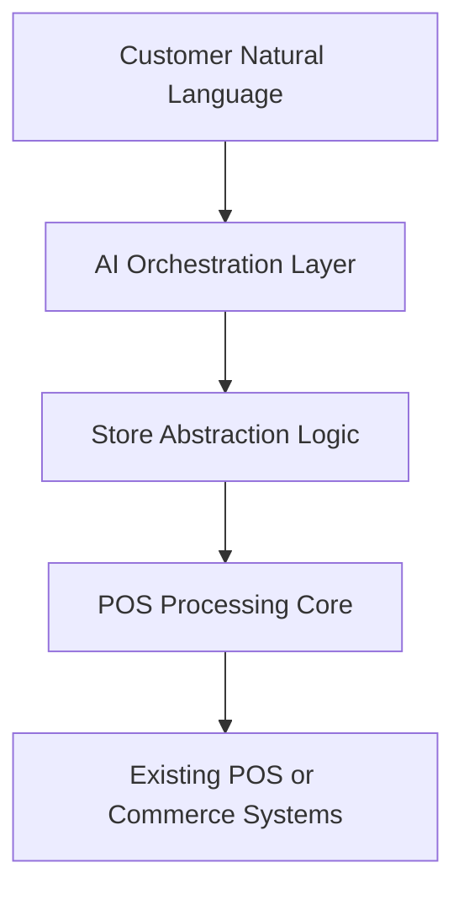
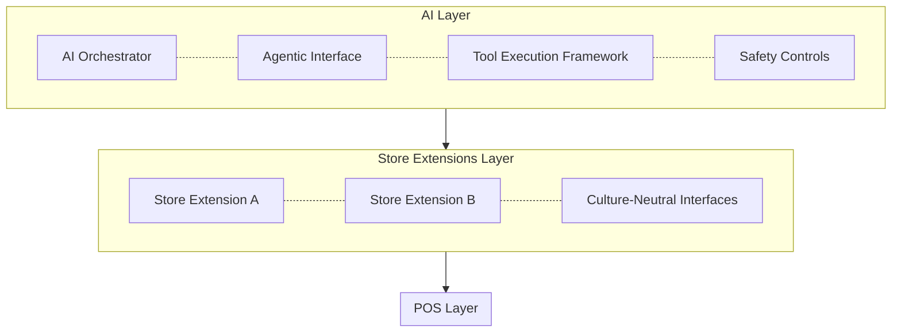
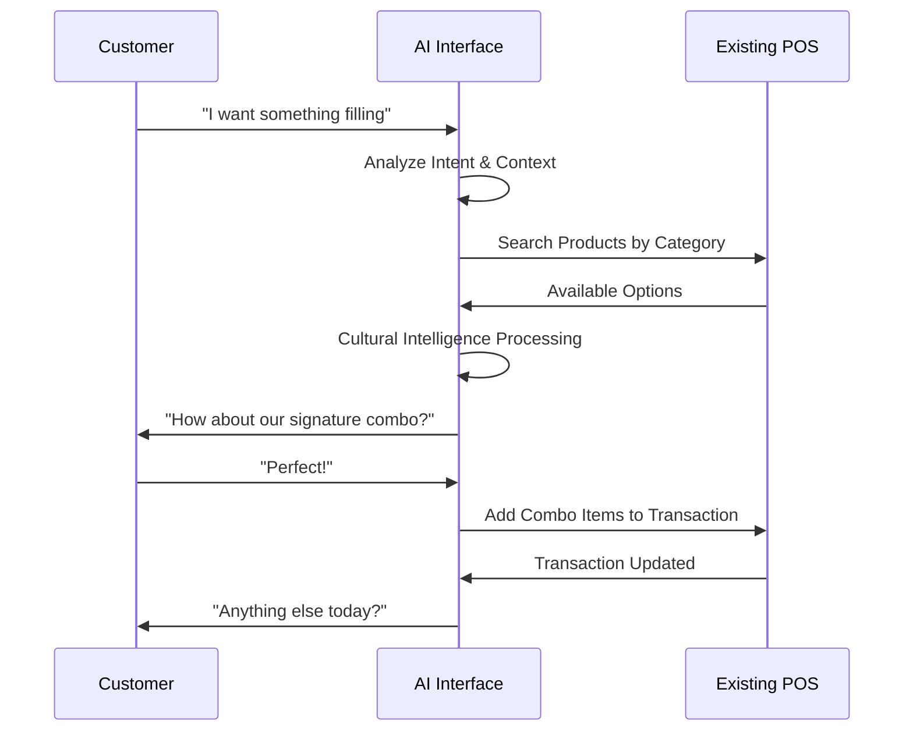
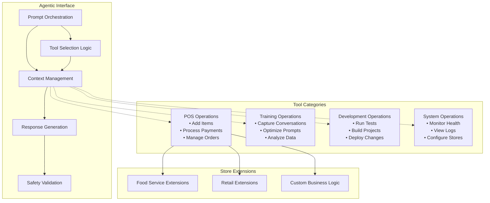
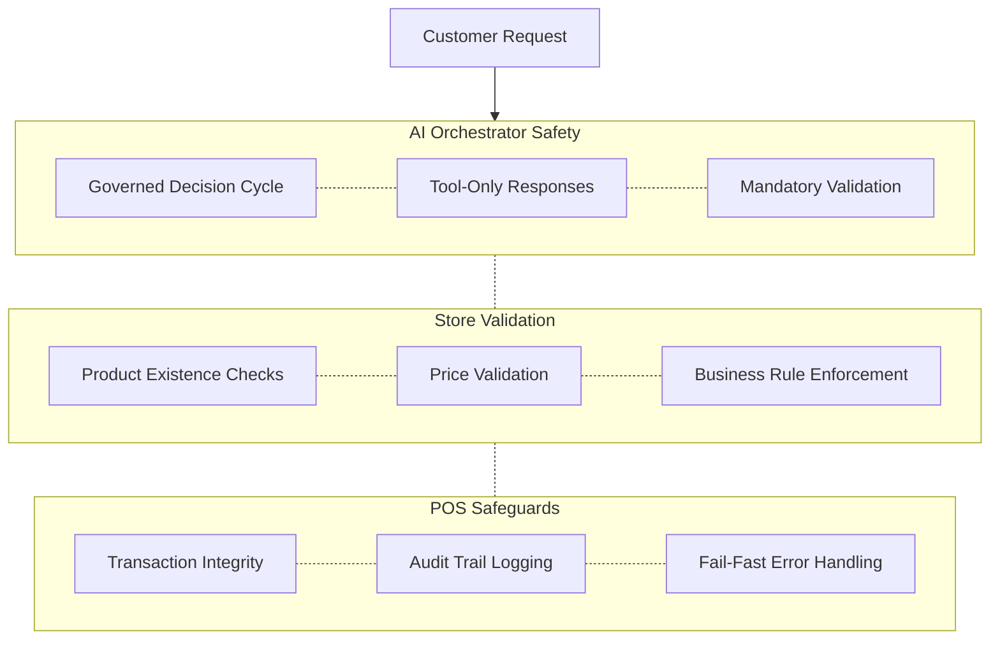
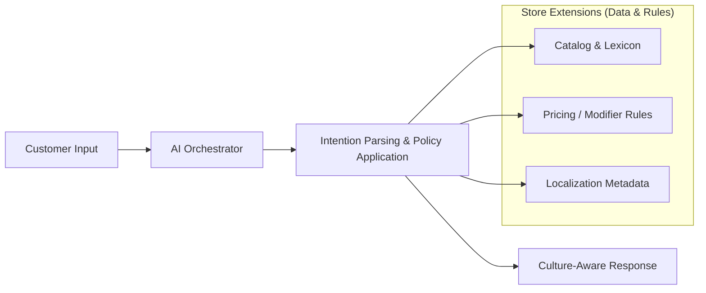
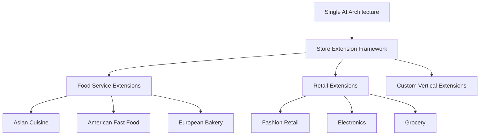

# AI-Enhanced POS Architecture
## Executive Presentation for Retail and Food Service Integration

**Target Audience:** IT Leadership, Food-Service and Retail Chains
**Objective:** Present AI-driven POS architecture for next-generation customer interaction
**Focus:** AI orchestration that integrates with existing infrastructure

---

## Slide 1: Executive Summary

### What This AI Architecture Delivers

**Core Value Proposition:** AI orchestration layer that handles natural language customer interactions while maintaining transaction integrity and cultural adaptability.

#### Key Capabilities:
- **Governed AI Execution**: Predictable, bounded decision cycle delivering stable response time, enforced safety controls, full auditability, and cost discipline (prevents runaway interactions)
- **Cultural Intelligence**: Support diverse customer languages and ordering patterns through store extensions
- **Anti-Hallucination Safety**: Fail-fast architecture preventing AI from creating non-existent products
- **Infrastructure Integration**: Designed to work with existing transaction systems

#### Business Impact:
- **Enhanced Customer Experience**: Natural conversation instead of menu navigation
- **Reduced Training Complexity**: Staff focus on service while AI handles interaction complexity
- **Cultural Adaptation**: Store-specific extensions handle local business rules and communication styles
- **Operational Safety**: Architectural safeguards prevent costly AI errors



---

## Slide 2: Architecture Overview

### Three-Layer Unified Architecture

**Integration Strategy:** AI orchestration layer operates independently while communicating with existing systems through well-defined interfaces.



### Key Architectural Principles:
- **Layer Independence**: Swap or evolve layers without ripple effects
- **Culture-Neutral Core**: POS processing stays free of currency & local business rule assumptions
- **Fail-Fast Design**: Missing configuration triggers immediate, explicit errors (no silent defaults)

---

## Slide 3: AI Interface to Users

### Natural Language Customer Interaction

**Customer Experience Transformation:** Instead of navigating complex menus, customers can order naturally in their preferred communication style.

#### Real-World Examples:

**Traditional Fast-Food Interaction:**
```
Staff: "Welcome to [Store]. What would you like today?"
Customer: "Uh... let me see... I want a combo number 2... with medium fries... and a Coke."
Staff: [Navigates menu system, selects items]
```

**AI-Enhanced Interaction:**
```
AI: "Hi! What can I get for you today?"
Customer: "I'm really hungry - something filling with fries and a drink"
AI: [Analyzes intent] "How about our signature chicken combo? Comes with fries and your choice of drink."
Customer: "Perfect!"
AI: [Automatically adds appropriate combo to transaction]
```



#### Cultural Intelligence Benefits:
- **Multilingual Support**: Understands ordering patterns across cultures
- **Context Awareness**: Considers time of day, previous orders, preferences
- **Upselling Intelligence**: Natural suggestions that feel helpful, not pushy

---

## Slide 4: AI Orchestration & Agentic Interface

### Unified Agentic Architecture

**Agentic Advantage:** Single interface for all AI operations - POS transactions, training, development, and system monitoring through standardized tool execution.



#### AI Orchestration Benefits:
- **Unified Interface**: All operations through consistent agentic protocol
- **Tool Extensibility**: Add new capabilities without AI model retraining
- **Safety Controls**: Built-in validation and fail-fast error handling

#### Prompt Architecture & Governance
Purpose-built prompt layering ensures predictable AI behavior, cultural adaptability, and verifiable safety.

Key Layers (merged at runtime):
- **System Guardrails**: Non-negotiable safety + tool-only execution directives (no free-form speculation)
- **Role & Tone**: Conversation style (e.g., friendly concise cashier) separated from policy rules
- **Store Context Overlay**: Dynamic product lexicon, cultural phrases, restricted items, pricing semantics
- **Conversation State Injection**: Recent validated turns (bounded window) – never raw unvalidated model output
- **Tool & Schema Guidance**: Explicit JSON / argument contracts; mandates using provided tools for all state changes
- **Safety Assertions**: Hard instructions forbidding price invention, currency assumptions, or product creation

Governance & Control:
- **Versioned Templates**: Every prompt bundle has semantic version + content hash recorded in audit logs
- **Store-Specific Extensions**: Supply only localized overlays; cannot override core safety guardrails
- **Change Review Path**: Experimental prompt tweaks evaluated offline against regression test corpus before promotion
- **Observability**: Each interaction stores (prompt_set_version, hash, tool_calls, validation_results) for traceability
- **Optimization Loop**: Captured conversations → structured feedback → targeted prompt diff → re-test → controlled release

Benefits:
- **Deterministic Boundaries**: Clear separation between invariant safety language and adaptive store overlays
- **Rapid Localization**: Add or adjust store phrasing without risking core safety integrity
- **Auditable Evolution**: Every production change traceable to reviewed prompt diff

---

## Slide 5: Anti-Hallucination Safety System

### Fail-Fast Architecture for Zero-Error Operation

**Critical Business Requirement:** AI must never create non-existent products or prices. The architecture enforces this through multiple safety layers.

#### Multi-Layer Defense System:



#### Safety Implementation:
- **AI Orchestrator**: Governed decision cycle eliminates uncontrolled multi-step drift
- **Store Extensions**: All product and pricing logic validated by business-specific code
- **Kernel Protection**: Transaction engine only accepts validated, structured data
- **No Silent Defaults**: System fails immediately when invalid data detected
- **Complete Audit Trail**: Every AI decision and validation step logged
- **Cultural Isolation**: AI cannot make assumptions about currencies or business rules

---

## Slide 6: Customer-Facing Use Cases

### Enhanced Customer Experience Scenarios

#### Use Case 1: Complex Order Simplification
**Scenario:** Customer wants family meal but doesn't know menu details

```
Customer: "I need to feed a family of 4, mix of adults and kids"
AI: "I'd recommend our Family Pack - 4 entrees, sides, and drinks. You can mix adult and kid options."
Result: Simplified ordering, increased average transaction value
```

#### Use Case 2: Cultural Communication Adaptation
**Scenario:** AI layer interprets diverse customer communication styles using store-provided catalogs & metadata (extensions are passive data/services, not reasoning agents)

```
Direct Style: "I want a burger combo"
→ AI Orchestrator: Interprets intent → queries catalog → selects matching combo

Conversational Style: "What's good here? Something filling..."
→ AI Orchestrator: Infers need (hearty meal) → retrieves popular/high-satiety items via extension data → proposes option

Cultural Terms: "One kopi c kosong" (Singapore coffee terminology)
→ AI Orchestrator: Parses cultural phrase using mapped lexicon from extension → resolves to product + modifiers
```

#### Use Case 3: Business Rule Enforcement
**Scenario:** Policies differ by store; AI enforces them by consulting extension-provided rules

```
Free Modifications Store: "Extra sauce on that burger"
→ AI Orchestrator: Validates modifier → extension pricing rule = free → adds at zero cost

Premium Store: "Can I get that with extra sauce?"
→ AI Orchestrator: Validates modifier → extension pricing rule = surcharge → adds with upcharge

Result: Same AI logic, policy variance comes from extension configuration/services
```



#### ROI Impact:
- **Faster Order Processing**: Reduced customer decision time
- **Higher Average Transaction**: Intelligent upselling and combo suggestions
- **Reduced Staff Training**: Less menu memorization required
- **Enhanced Accessibility**: Better service for diverse customer base

---

#### Architecture Benefits:
- **Single AI Logic**: One orchestrator interprets intent & applies policies across store types
- **Config-Driven Policy**: Store extensions supply data/rules; they do not perform reasoning
- **Cultural Adaptation**: Local lexicon & product metadata shape AI responses without code fork
- **Operational Consistency**: Central AI behavior + decentralized rule data = easier maintenance

#### Scalability Pattern:


---

## Slide 8: Implementation Strategy & Business Value

### Deployment Architecture & Integration Approach

#### Integration Phases

**Phase 1: Architecture Foundation**
- Deploy core AI and POS integration layers
- Implement store extension framework
- Establish safety controls and fail-fast mechanisms

**Phase 2: Store Extension Development**
- Develop business-specific store extensions
- Implement cultural intelligence for target markets
- Validate anti-hallucination safety systems

**Phase 3: Production Deployment**
- Deploy to production environment
- Integrate with existing infrastructure via standard APIs
- Monitor performance and safety metrics

#### Expected Business Outcomes:

**Operational Benefits:**
- **Safety & Performance Predictability**: Bounded decision cycle + fail-fast design eliminate variability and hidden risk
- **Cultural Adaptability**: Store extensions handle diverse business requirements
- **Reduced Training Complexity**: Staff focus on service while AI handles interaction complexity

**Technical Advantages:**
- **Layer Independence**: Replace or upgrade components without system-wide impact
- **Infrastructure Compatibility**: Designed to integrate with existing transaction systems
- **Scalable Architecture**: Add new store types through extension framework
- **Maintenance Efficiency**: Centralized AI logic with distributed business rules

---

## Appendix: Technical Implementation Details

### Architecture Components
- **AI Orchestrator**: Governed, bounded decision cycle for predictable performance, safety, and auditability
- **Agentic Interface**: Unified tool execution framework
- **Prompt Orchestration**: Layered, versioned prompt assembly (guardrails → role/tone → store overlays → state) with audit hashes
- **Store Extensions**: Culture-neutral interfaces with business-specific implementations
- **POS Processing Core**: Culture-agnostic transaction processing layer

### Integration Capabilities
- **Direct Call API**: In-process integration for maximum performance
- **Named Pipe IPC**: Local inter-process communication
- **REST/gRPC**: Network-based integration with existing systems
- **Standard Protocols**: Compatible with common POS integration patterns

### Security & Compliance
- **Fail-Fast Design**: Immediate failure on invalid configuration or data
- **Audit Logging**: Complete trail of AI decisions and validation steps
- **Data Separation**: AI orchestration separated from sensitive transaction data
- **Layer Independence**: Security boundaries between AI, business logic, and transaction processing

### Demonstration Availability
- **Food Service Verticals**: Singapore Kopitiam and American Coffee Shop implementations
- **Terminal UI Demo**: Working demonstration of AI orchestration
- **Cultural Intelligence**: Multi-language and business rule examples
- **Safety Validation**: Anti-hallucination mechanisms in operation

**Questions & Discussion**

---

*This presentation demonstrates an AI orchestration architecture that enhances customer interaction while maintaining transaction integrity and cultural adaptability through a layered, extensible design.*
