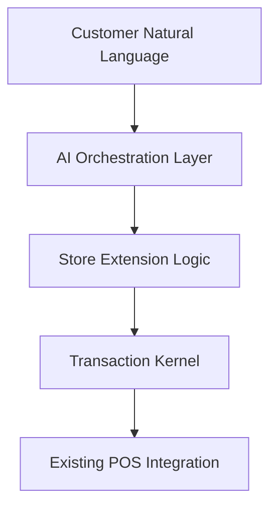
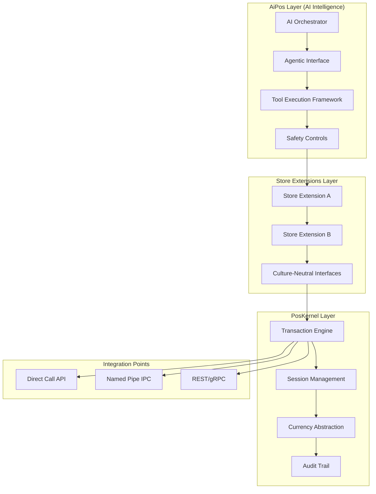
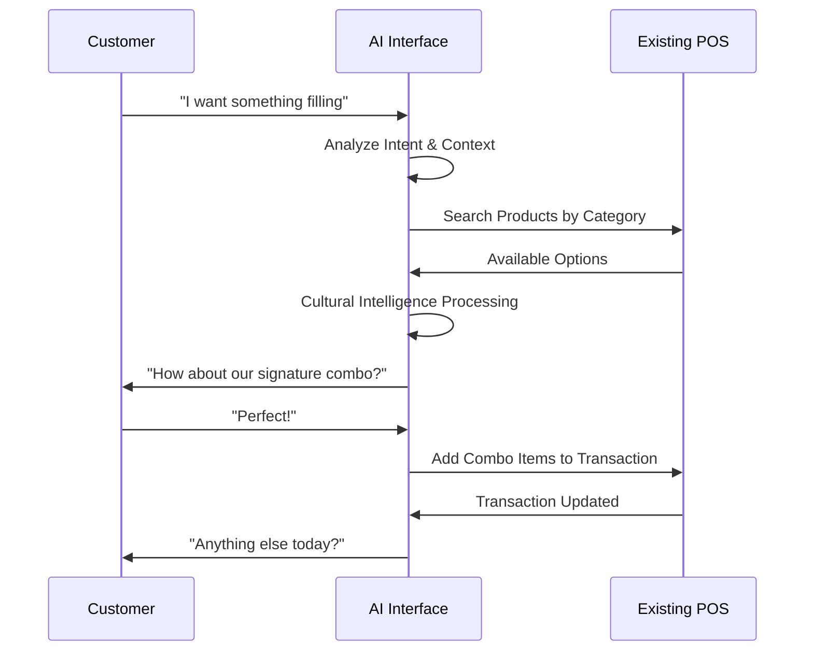
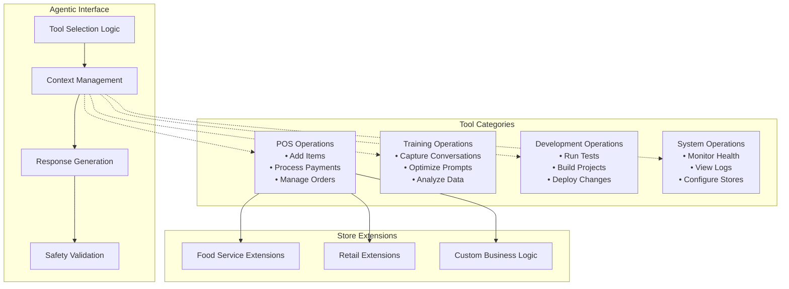
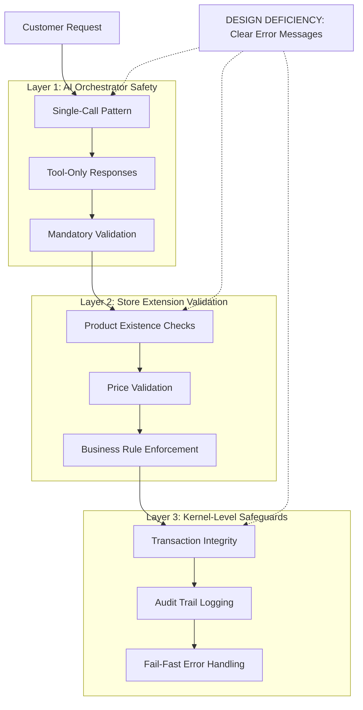
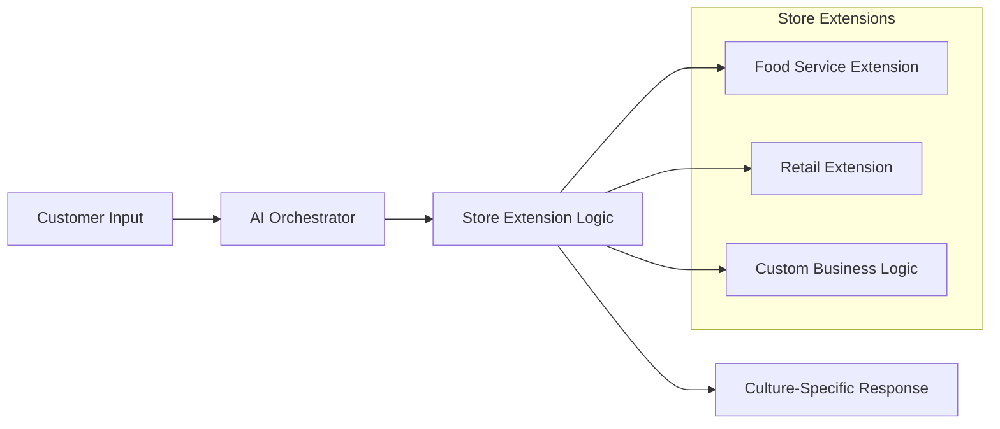
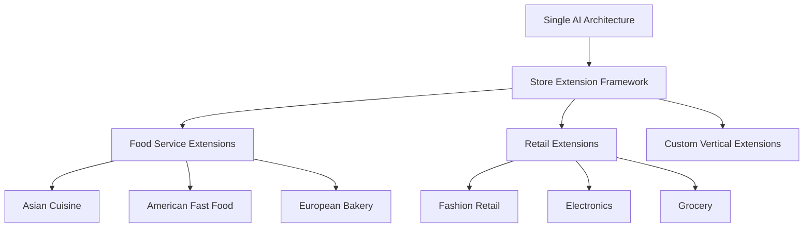
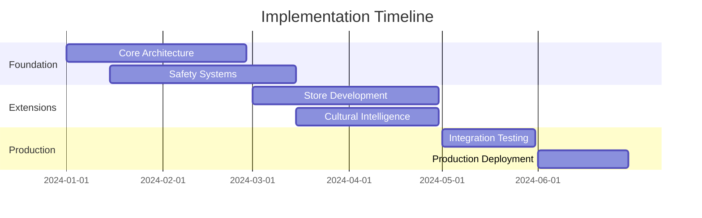

# AI-Enhanced POS Architecture
## Executive Presentation for Retail and Food Service Integration

**Target Audience:** IT Leadership, Food-Service and Retail Chains
**Objective:** Present AI-driven POS architecture for next-generation customer interaction
**Focus:** AI orchestration that integrates with existing infrastructure

---

## Slide 1: Executive Summary

### What This AI Architecture Delivers

**Core Value Proposition:** AI orchestration layer that handles natural language customer interactions while maintaining transaction integrity and cultural adaptability.

#### Key Capabilities:
- **AI Orchestration**: Single-call pattern for predictable performance and reliable operation
- **Cultural Intelligence**: Support diverse customer languages and ordering patterns through store extensions
- **Anti-Hallucination Safety**: Fail-fast architecture preventing AI from creating non-existent products
- **Infrastructure Integration**: Designed to work with existing transaction systems

#### Business Impact:
- **Enhanced Customer Experience**: Natural conversation instead of menu navigation
- **Reduced Training Complexity**: Staff focus on service while AI handles interaction complexity
- **Cultural Adaptation**: Store-specific extensions handle local business rules and communication styles
- **Operational Safety**: Architectural safeguards prevent costly AI errors



---

## Slide 2: Architecture Overview

### Three-Layer Unified Architecture

**Integration Strategy:** AI orchestration layer operates independently while communicating with existing systems through well-defined interfaces.



### Key Architectural Principles:
- **Layer Independence**: Each layer can be replaced without affecting others
- **Culture-Neutral Core**: Transaction kernel knows nothing about business rules or currencies
- **Fail-Fast Design**: Missing configuration causes immediate failure, never silent defaults
- **AI Orchestration**: Single-call pattern for predictable performance

---

## Slide 3: AI Interface to Users

### Natural Language Customer Interaction

**Customer Experience Transformation:** Instead of navigating complex menus, customers can order naturally in their preferred communication style.

#### Real-World Examples:

**Traditional Fast-Food Interaction:**
```
Staff: "Welcome to [Store]. What would you like today?"
Customer: "Uh... let me see... I want a combo number 2... with medium fries... and a Coke."
Staff: [Navigates menu system, selects items]
```

**AI-Enhanced Interaction:**
```
AI: "Hi! What can I get for you today?"
Customer: "I'm really hungry - something filling with fries and a drink"
AI: [Analyzes intent] "How about our signature chicken combo? Comes with fries and your choice of drink."
Customer: "Perfect!"
AI: [Automatically adds appropriate combo to transaction]
```



#### Cultural Intelligence Benefits:
- **Multilingual Support**: Understands ordering patterns across cultures
- **Context Awareness**: Considers time of day, previous orders, preferences
- **Upselling Intelligence**: Natural suggestions that feel helpful, not pushy

---

## Slide 4: AI Orchestration & Agentic Interface

### Unified Agentic Architecture

**Agentic Advantage:** Single interface for all AI operations - POS transactions, training, development, and system monitoring through standardized tool execution.



#### AI Orchestration Benefits:
- **Single-Call Pattern**: Predictable performance with deterministic timing
- **Unified Interface**: All operations through consistent agentic protocol
- **Tool Extensibility**: Add new capabilities without AI model retraining
- **Safety Controls**: Built-in validation and fail-fast error handling

---

## Slide 5: Anti-Hallucination Safety System

### Fail-Fast Architecture for Zero-Error Operation

**Critical Business Requirement:** AI must never create non-existent products or prices. The architecture enforces this through multiple safety layers.

#### Multi-Layer Defense System:



#### Safety Implementation:
- **AI Orchestrator**: Single-call pattern eliminates multi-step reasoning errors
- **Store Extensions**: All product and pricing logic validated by business-specific code
- **Kernel Protection**: Transaction engine only accepts validated, structured data
- **No Silent Defaults**: System fails immediately when invalid data detected
- **Complete Audit Trail**: Every AI decision and validation step logged
- **Cultural Isolation**: AI cannot make assumptions about currencies or business rules

---

## Slide 6: Customer-Facing Use Cases

### Enhanced Customer Experience Scenarios

#### Use Case 1: Complex Order Simplification
**Scenario:** Customer wants family meal but doesn't know menu details

```
Customer: "I need to feed a family of 4, mix of adults and kids"
AI: "I'd recommend our Family Pack - 4 entrees, sides, and drinks. You can mix adult and kid options."
Result: Simplified ordering, increased average transaction value
```

#### Use Case 2: Cultural Communication Adaptation
**Scenario:** Store extension handles diverse customer communication styles

```
Direct Style: "I want a burger combo"
→ Store Extension: Maps to appropriate combo product

Conversational Style: "What's good here? Something filling..."
→ Store Extension: Suggests popular filling options based on store data

Cultural Terms: "One kopi c kosong" (Singapore coffee terminology)
→ Store Extension: Translates to appropriate product in local catalog
```

#### Use Case 3: Business Rule Enforcement
**Scenario:** Different stores have different policies handled by extensions

```
Free Modifications Store: "Extra sauce on that burger"
→ Extension: Adds modification at no charge

Premium Store: "Can I get that with extra sauce?"
→ Extension: Adds modification with appropriate upcharge

Result: Same AI orchestrator, different business outcomes
```



#### ROI Impact:
- **Faster Order Processing**: Reduced customer decision time
- **Higher Average Transaction**: Intelligent upselling and combo suggestions
- **Reduced Staff Training**: Less menu memorization required
- **Enhanced Accessibility**: Better service for diverse customer base

---

## Slide 7: Store Extension Examples

### Demonstrable Cultural and Business Adaptability

#### Demo Implementation: Food Service Vertical

**Singapore Kopitiam Style (Toast Boleh)**
```json
{
  "storeType": "SingaporeanKopitiam",
  "currency": "SGD",
  "culture": "en-SG",
  "supportedLanguages": ["en-SG", "zh-CN", "ms-MY", "ta-IN"],
  "businessRules": {
    "modificationPricing": "free",
    "tipCulture": false,
    "taxInclusive": true
  }
}
```

**American Coffee Shop Style (Star Grounds)**
```json
{
  "storeType": "AmericanCoffeeShop",
  "currency": "USD",
  "culture": "en-US",
  "supportedLanguages": ["en-US", "es-MX", "fr-CA"],
  "businessRules": {
    "modificationPricing": "charged",
    "tipCulture": true,
    "taxInclusive": false
  }
}
```

#### Architecture Benefits:
- **Same AI Orchestrator**: Identical AI logic handles both store types
- **Different Business Logic**: Store extensions enforce appropriate rules
- **Cultural Intelligence**: Language and communication patterns adapted per store
- **Operational Consistency**: Same training and maintenance across different business models

#### Scalability Pattern:


---

## Slide 8: Implementation Strategy & Business Value

### Deployment Architecture & Integration Approach

#### Deployment Strategy

**Separate Service Architecture:**
- **`~/.aipos/`**: AI models, prompts, training data, agentic configurations
- **`~/.poskernel/`**: Transaction kernel, store configurations, audit trails

**Installation & Updates:**
```powershell
install-aipos.ps1        # Install/update AI orchestration layer
install-poskernel.ps1    # Install/update transaction kernel
install-demo.ps1         # Install/update store extension examples
```

#### Integration Phases

**Phase 1: Architecture Foundation (Month 1-2)**
- Deploy core AiPos and PosKernel layers
- Implement store extension framework
- Establish safety controls and fail-fast mechanisms

**Phase 2: Store Extension Development (Month 3-4)**
- Develop business-specific store extensions
- Implement cultural intelligence for target markets
- Validate anti-hallucination safety systems

**Phase 3: Production Deployment (Month 5-6)**
- Deploy to production environment
- Integrate with existing infrastructure via standard APIs
- Monitor performance and safety metrics



#### Expected Business Outcomes:

**Operational Benefits:**
- **Predictable Performance**: Single-call AI pattern eliminates processing variability
- **Cultural Adaptability**: Store extensions handle diverse business requirements
- **Reduced Training Complexity**: Staff focus on service while AI handles interaction complexity
- **Safety Assurance**: Fail-fast architecture prevents costly AI errors

**Technical Advantages:**
- **Layer Independence**: Replace or upgrade components without system-wide impact
- **Infrastructure Compatibility**: Designed to integrate with existing transaction systems
- **Scalable Architecture**: Add new store types through extension framework
- **Maintenance Efficiency**: Centralized AI logic with distributed business rules

---

## Appendix: Technical Implementation Details

### Architecture Components
- **AI Orchestrator**: Single-call pattern for predictable performance
- **Agentic Interface**: Unified tool execution framework
- **Store Extensions**: Culture-neutral interfaces with business-specific implementations
- **Transaction Kernel**: Culture-agnostic transaction processing

### Integration Capabilities
- **Direct Call API**: In-process integration for maximum performance
- **Named Pipe IPC**: Local inter-process communication
- **REST/gRPC**: Network-based integration with existing systems
- **Standard Protocols**: Compatible with common POS integration patterns

### Security & Compliance
- **Fail-Fast Design**: Immediate failure on invalid configuration or data
- **Audit Logging**: Complete trail of AI decisions and validation steps
- **Data Separation**: AI orchestration separated from sensitive transaction data
- **Layer Independence**: Security boundaries between AI, business logic, and transaction processing

### Demonstration Availability
- **Food Service Verticals**: Singapore Kopitiam and American Coffee Shop implementations
- **Terminal UI Demo**: Working demonstration of AI orchestration
- **Cultural Intelligence**: Multi-language and business rule examples
- **Safety Validation**: Anti-hallucination mechanisms in operation

**Questions & Discussion**

---

*This presentation demonstrates an AI orchestration architecture that enhances customer interaction while maintaining transaction integrity and cultural adaptability through a layered, extensible design.*
