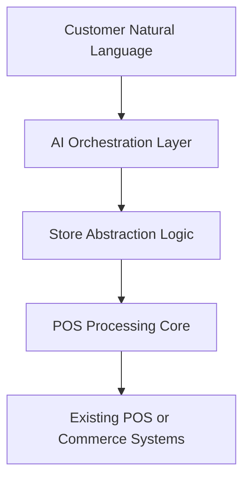
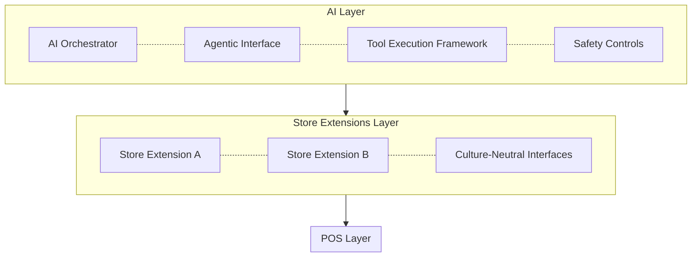
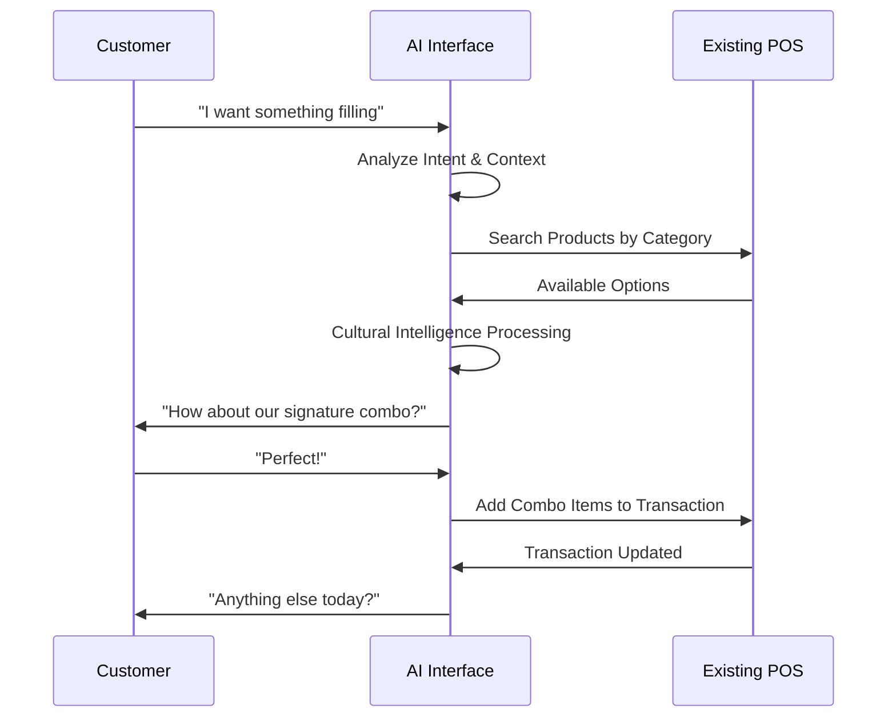
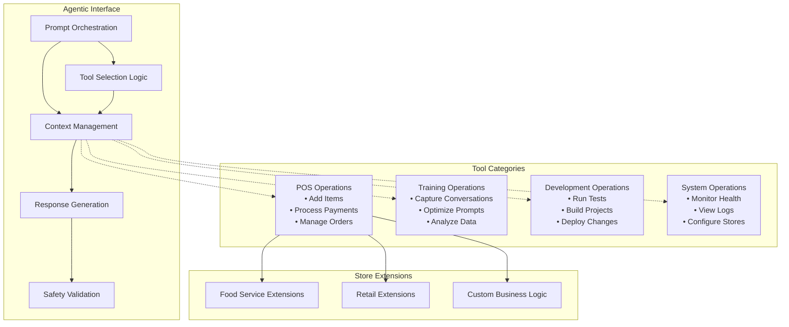
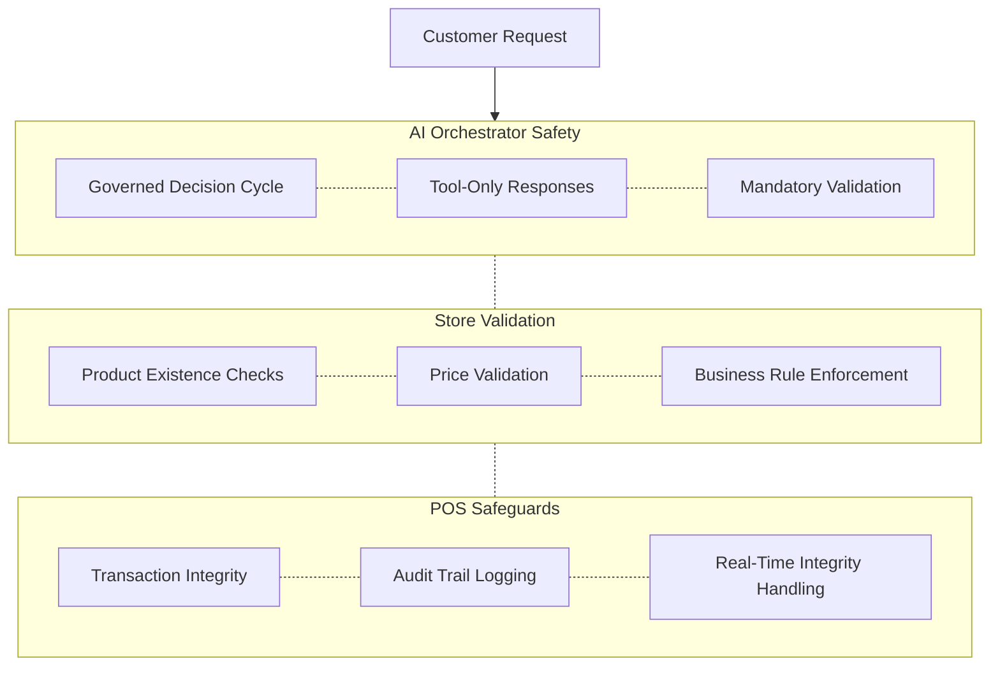
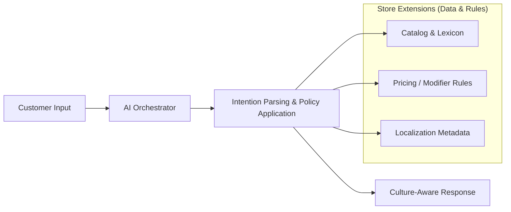
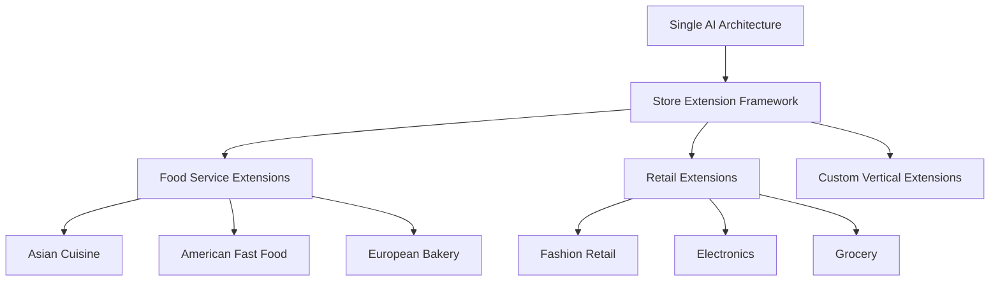

# AI-Enhanced POS Architecture
## Executive Overview – Retail & Food Service

**Audience:** Business & Technology Leadership
**Objective:** Show how an AI orchestration layer creates measurable customer + operational value without replacing existing POS investments.
**Focus:** Business outcomes (experience, revenue, efficiency), with safety & integration handled under the hood.

---

## Slide 1: Executive Summary

### What This AI Architecture Delivers

**Core Value Proposition:** Conversational AI orchestration that understands natural customer intent, applies store context, and drives higher-value, faster transactions—while plugging into current POS systems.

#### Key Capabilities (Outcome Framed):
- **Conversational Ordering:** Removes friction vs menu drilling
- **Context & Cultural Adaptation:** Understands local product lexicon and ordering slang
- **Trusted Suggestions:** Recommends profitable, relevant bundles (not random upsells)
- **Seamless Integration:** Works alongside existing POS / commerce stack—no rip & replace
- **Operational Trust:** Guardrails prevent invalid items or prices (quietly, automatically)

#### Business Impact:
- **Higher Throughput:** Faster intent capture → shorter queues
- **Increased Average Ticket:** Intelligent, context-aware add‑ons & set suggestions
- **Lower Training Overhead:** Staff supervise; AI guides complexity
- **Rapid Market Localization:** Add a store extension, not a new AI model
- **Reliable Compliance:** Only valid products & prices flow through



---

## Slide 2: Architecture at a Glance

### Three-Layer Unified Architecture

**Integration Strategy:** AI orchestration layer operates independently while communicating with existing systems through well-defined interfaces.



### Guiding Principles (Business Translation):
- **Plug-In, Not Rewrite:** AI layer overlays—your core POS engine remains stable
- **Config + Data > Code Forks:** Store extensions supply vocabulary & pricing context
- **Guarded AI, Quiet Safety:** Reliability and correctness are enforced behind the scenes
- **Swap-Friendly:** Each layer can evolve without stalling the others

---

## Slide 3: AI Customer Interaction

### Natural Language Customer Interaction

**Experience Shift:** From “hunt & tap menus” to a natural conversation that still yields structured, compliant orders.

#### Real-World Examples:

**Traditional Fast-Food Interaction:**
```
Staff: "Welcome to [Store]. What would you like today?"
Customer: "Uh... let me see... I want a combo number 2... with medium fries... and a Coke."
Staff: [Navigates menu system, selects items]
```

**AI-Enhanced Interaction:**
```
AI: "Hi! What can I get for you today?"
Customer: "I'm really hungry - something filling with fries and a drink"
AI: [Analyzes intent] "How about our signature chicken combo? Comes with fries and your choice of drink."
Customer: "Perfect!"
AI: [Automatically adds appropriate combo to transaction]
```



#### Experience Benefits:
- **Understands Local Terms:** e.g., “kopi c kosong” → correct product + modifiers
- **Adaptive Suggestions:** Uses context (time / order pattern) to propose relevant sets
- **Friction Reduction:** Fewer clarifying questions; faster confirmation loops
- **Natural Upsell:** Contextual, not spammy

---

## Slide 4: Unified AI Orchestration

### Unified Agentic Architecture

**Agentic Advantage:** Single interface for all AI operations - POS transactions, training, development, and system monitoring through standardized tool execution.



#### Orchestration Advantages:
- **Single Contract:** Same interface for ordering, training feedback, or operations
- **Extend Without Retrain:** New tools = new capability surfaces
- **Cost & Latency Discipline:** Bounded single-pass reasoning keeps response time predictable
- **Embedded Safety:** Invalid outputs filtered before they ever hit the POS engine

#### Prompt Architecture (Condensed):
Layered assembly: (1) Guardrails (2) Tone (3) Store overlay (4) Recent state (5) Tool schemas.
Outcome: Predictable behavior + fast localization without destabilizing safety.

---

## Slide 5: Trust & Safety (Outcome Focus)

### Proactive Validation Architecture for Zero-Error Operation

**Business Requirement:** Never sell what you can’t fulfill; never invent prices. The platform enforces this quietly.

#### Defense-in-Depth (Summarized):



#### Practical Effects Stakeholders Care About:
- Incorrect items are proactively blocked before ticket creation
- Price integrity preserved (no ad‑hoc hallucinated numbers)
- Transparent trace path for regulated / high-risk environments
- Consistent behavior across geographies

---

## Slide 6: High-Value Use Cases

### Enhanced Customer Experience Scenarios

#### Use Case 1: Complex Order Simplification
**Scenario:** Customer wants family meal but doesn't know menu details

```
Customer: "I need to feed a family of 4, mix of adults and kids"
AI: "I'd recommend our Family Pack - 4 entrees, sides, and drinks. You can mix adult and kid options."
Result: Simplified ordering, increased average transaction value
```

#### Use Case 2: Cultural / Local Phrase Adaptation

```
Direct Style: "I want a burger combo"
→ AI Orchestrator: Interprets intent → queries catalog → selects matching combo

Conversational Style: "What's good here? Something filling..."
→ AI Orchestrator: Infers need (hearty meal) → retrieves popular/high-satiety items via extension data → proposes option

Cultural Terms: "One kopi c kosong" (Singapore coffee terminology)
→ AI Orchestrator: Parses cultural phrase using mapped lexicon from extension → resolves to product + modifiers
```

#### Use Case 3: Policy & Pricing Consistency
**Scenario:** Policies differ by store; AI enforces them by consulting extension-provided rules

```
Free Modifications Store: "Extra sauce on that burger"
→ AI Orchestrator: Validates modifier → extension pricing rule = free → adds at zero cost

Premium Store: "Can I get that with extra sauce?"
→ AI Orchestrator: Validates modifier → extension pricing rule = surcharge → adds with upcharge

Result: Same AI logic, policy variance comes from extension configuration/services
```



#### Measurable Impact:
- Faster order completion time
- Higher attach / combo uptake rates
- Lower training & onboarding time
- Better accessibility & inclusivity

---

#### Platform Advantages:
- One orchestrator → many store types
- Config / data driven localization (not branches of code)
- Consistent compliance & messaging
- Faster rollout of new market formats

#### Scalability Pattern:


---

## Slide 7: Implementation Phases & Value

### Deployment Architecture & Integration Approach

#### Integration Phases

**Phase 1: Foundation**
- Stand up AI orchestration + extension framework
- Connect to existing transaction engine / POS
- Baseline safety & observability

**Phase 2: Extension Scaling**
- Add priority store types / locales
- Tune conversation tone + localized lexicon
- Optimize suggestion strategies

**Phase 3: Operationalization**
- Gradual rollout & KPI tracking
- Feedback-driven prompt refinement
- Expansion to additional verticals

#### Outcome Summary:
| Category | Improvement Examples |
|----------|----------------------|
| Revenue Uplift | Attach rate, combo conversion |
| Throughput | Reduced order handling time |
| Labor Efficiency | Shorter training / shadowing |
| Localization Speed | New market onboarding time |
| Compliance / Trust | Fewer voids / corrections |

---

## Appendix (Optional): Technical Notes

### Core Components (Condensed)
- AI Orchestrator (bounded, single-pass process)
- Agentic Tool Interface (POS ops / training / ops)
- Prompt Layering (guardrails → tone → store overlay → state)
- Store Extensions (data & policy surface)
- POS Engine (pricing, tender, totals – culture-neutral)

### Integration Options
- In-process (lowest latency)
- Local IPC (process isolation)
- REST / gRPC (existing estate integration)

### Trust & Governance
- Validation before commit (product / price integrity)
- Auditable interaction metadata
- Separation of concern boundaries
- Localized overlays cannot override core safety

### Demonstration Coverage
- Food service (Singapore Kopitiam, Coffee Shop)
- Natural language ordering demo
- Cultural term resolution example
- Suggestion + validation flow

**Questions & Discussion**

---

*This platform adds an adaptive conversational layer that increases order value and speed while preserving the reliability of your existing POS foundation.*
